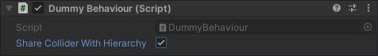
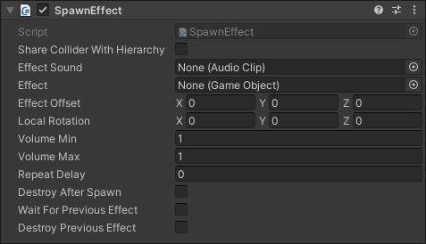
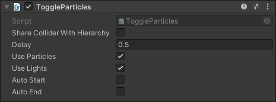
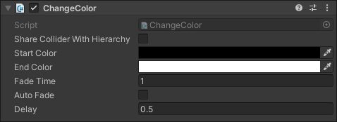
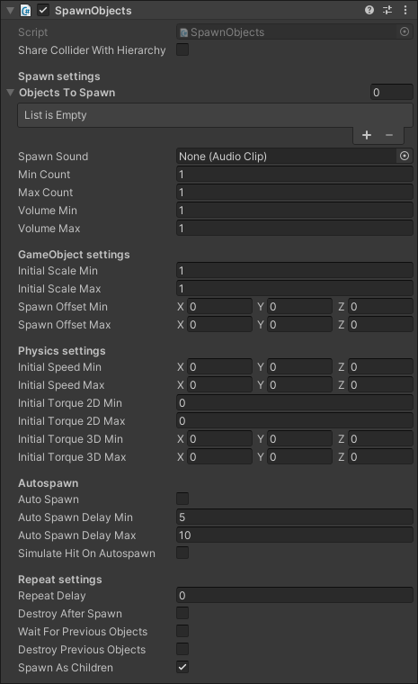

Title:   Behaviour scripts
Summary: A closer look at behaviour scripts
Authors: Ondrej Prucha
Date:    August 6, 2024
blank-value:

# Pre-made behaviour scripts

In this chapter, we will explore the pre-made behavior scripts provided by the Initi Playground SDK. These scripts are designed to streamline the development process by offering ready-to-use functionality for common interactive elements. Each script has specific uses and can help you quickly add interactivity to your game.

## Shared properties

Each behavior script, whether pre-made or custom-built in the future, begins by extending the `BaseHittable` class. This class provides a `Share Collider With Hierarchy` property, which is accessible to all behavior scripts.

{: .center }

**Share Collider With Hierarchy** property is useful when you have multiple behaviors that you want to trigger from the same hit, but don’t want each object to have its own physics collider. When this property is set to `true`, the `Initi Input Controller` checks for any collider, that was hit, within the `transform.root` and its children. If it finds a collider, it triggers the hit. Conversely, setting `Share Collider With Hierarchy` to `false` ensures that the hit is only triggered if the collider is attached to the same `GameObject` that was hit.

!!! example
    **Example Use Case:** Imagine you have a torch, and you want a hit to trigger two actions: spawning a puff of smoke and turning on the fire particles. Instead of creating separate objects and physics colliders for each action, you can create a parent torch object with a single physics collider. Then, add the smoke and fire behaviours as child objects. By setting `Share Collider With Hierarchy` to `true`, both actions will use the collider from the parent object, streamlining your setup and reducing complexity.

## Spawn effect

One of the most straightforward and frequently used behaviors in the **Initi Playground SDK** is the `Spawn Effect` behavior. You can locate it by navigating to **Initi > Behaviour > SpawnEffect**. This behavior triggers a new effect prefab and plays a sound whenever the object is hit. Let's take a closer look at the parameters of this behavior to understand how to customize it for your needs.

{: .center }

|                                   |                                                   |
| --------------------------------- | ------------------------------------------------- |
| **Effect** | This parameter defines the prefab that will be instantiated when the object is hit. If no prefab is specified, the behavior will only play the assigned sound effect. |
| **Effect Sound** | This is the audio clip that will play when the object is hit. If no audio clip is assigned, the behavior will only instantiate the specified effect prefab.  |
| **Effect Offset** | The offset is a `Vector3` value that determines the position where the effect will be instantiated. If set to `Vector3.zero`, the effect will be created at the point where the object was hit.  |
| **Local Rotation** |  This parameter determines the rotation of the instantiated prefab. If set to `Vector3.zero`, the prefab's `localEulerAngles` will not be overridden, allowing the prefab to maintain its default rotation. |
| **Volume Min** | Sets the minimum volume level (from a range of `0-1`) at which the effect's audio will play. When used alongside the `Volume Max` setting, it allows for randomization of the sound's volume, which is particularly useful for adding variation to repeating sounds.  |
| **Volume Max** | Sets the maximum volume level (from a range of `0-1`) at which the effect's audio will play. When used alongside the `Volume Min` setting, it allows for randomization of the sound's volume, which is particularly useful for adding variation to repeating sounds.  |
| **Repeat Delay** | Specifies the minimum time, in seconds, that must elapse between successive hits before a new effect is spawned. If the object is hit again before this delay period has passed, the hit will be ignored, preventing the effect from being triggered too frequently.  |
| **Destroy After Spawn** | When enabled, the object will be destroyed immediately after it is hit. This is useful for creating temporary objects that respond to a hit only once. For instance, you might use this feature for a bubble object that creates a popping effect upon impact and then disappears.  |
| **Wait For Previous Effect** | When enabled, the object will delay spawning additional prefabs until the previously instantiated prefab has been destroyed.  |
| **Destroy Previous Effect** | When enabled, the object will destroy the previously instantiated prefab upon being hit, and immediately create a new prefab.  |

## Toggle particles

Another commonly used behavior is the `Toggle Particles`. You can find it under **Initi > Behaviour > ToggleParticles**. This behavior is useful for controlling particle effects and lights based on user interactions. It supports two primary use cases: the first is to activate lights and particles upon user touch and automatically turn them off after a set duration. The second mode allows you to toggle the effect on and off with each user interaction.

{: .center }

|                                   |                                                   |
| --------------------------------- | ------------------------------------------------- |
| **Delay** | The `Delay` parameter [in seconds] functions differently depending on the `Auto End` setting. If `Auto End` is enabled, the delay specifies the time after which the particles and lights will automatically turn off if no further touches occur. If `Auto End` is disabled, the delay determines the minimum time that must pass between consecutive touches for the hits to be registered, preventing the object from reacting to rapid, repeated touches. |
| **Use Particles** | When enabled, this behavior will manage all **particle systems** within the object and its child objects.  |
| **Use Lights** | When enabled, this behavior will manage all **lights** within the object and its child objects.  |
| **Auto Start** |  When enabled, particles and lights will automatically activate as soon as the object is instantiated. |
| **Auto End** | When enabled, particles and lights will automatically turn off if no touch is detected for the duration specified in the `Delay` parameter. If `Auto End` is set to false, the object will function as a toggle: the first touch activates the particles and lights, and the next touch deactivates them. To avoid the object being toggled off too quickly, the interval between touches should exceed the time specified in the `Delay` parameter.  |

## Change color

The next behavior, `ChangeColor`, operates similarly to `ToggleParticles`, but requires a `Sprite Renderer` component attached to the `GameObject` to control its color. You can find it under **Initi > Behaviour > ChangeColor**. This behavior also functions in two modes:

- **Continuous Mode:** The color will remain active as long as there is a continuous touch on the object and will gradually fade away once the touch is removed.
- **Toggle Mode:** The color acts like a switch, toggling between an active state and an inactive state with each touch.

{: .center }

|                                   |                                                   |
| --------------------------------- | ------------------------------------------------- |
| **Start Color** | This parameter sets the `color` of the `Sprite Renderer` when it is in the inactive state. By default, it is set to `Color.clear` |
| **End Color** | This parameter sets the `color` of the `Sprite Renderer` when it is in the active state. The default value is `Color.white`  |
| **Fade Time** | Determines the duration of the transition effect when fading from the active state to the inactive state.  |
| **Auto Fade** |  When enabled, the object will automatically fade to the inactive state if there is no touch for the duration specified by the `Delay` parameter. If `Auto Fade` is disabled, the behavior will act as a toggle switch, manually changing between the active and inactive states with each touch. |
| **Delay** | This parameter specifies the time [in seconds] that must pass before the `Auto Fade` takes effect. If `Auto Fade` is enabled, the object will start fading to the inactive state if there is no touch detected for the duration set by this delay. When `Auto Fade` is disabled, the `Delay` defines the minimum interval between successive touches; the object will only switch states if touches occur more than this time apart.   |

## Spawn objects

The final pre-made behavior is the `Spawn Objects` behavior. While it comes with more settings than the previous behaviors, most of them are straightforward to use. This behavior is useful when you need to create multiple objects either on touch or automatically after a specified time interval. Let's take a closer look at the properties of the `Spawn Objects` behavior:

{: .center }

|                                   |                                                   |
| --------------------------------- | ------------------------------------------------- |
| | **Spawn Settings**  |
| **Objects To Spawn** | A list of prefabs that the behavior will use to randomly select and spawn an object each time the behavior is triggered. Instead of spawning the same object repeatedly, this property allows for variety by randomly choosing from the list of prefabs you've provided.  |
| **Spawn Sound** | An `Audio Clip` that will play each time the behavior is triggered. If no audio clip is assigned to this property, the spawning action will occur silently.   |
| **Min Count** | The minimum number of objects that will be spawned each time the behavior is triggered.  |
| **Max Count** | The maximum number of objects that will be spawned each time the behavior is triggered. The exact number of objects spawned will be a random value between the `Min Count` (inclusive) and `Max Count` (exclusive) settings |
| **Volume Min** |  Sets the minimum volume level (from a range of `0-1`) at which the `Spawn Sound` audio will play. When used alongside the `Volume Max` setting, it allows for randomization of the sound's volume, which is particularly useful for adding variation to repeating sounds.  |
| **Volume Max** |  Sets the maximum volume level (from a range of `0-1`) at which the `Spawn Sound` audio will play. When used alongside the `Volume Min` setting, it allows for randomization of the sound's volume, which is particularly useful for adding variation to repeating sounds.  |
| | **GameObject Settings**  |
| **Initial Scale Min** | The minimum size that the spawned objects can be when they first appear in the scene. This value determines the smallest possible scale for the objects. The final scale of each spawned object will be a random value between the `Initial Scale Min` and `Initial Scale Max` settings, allowing for variation in the size of the spawned objects.  |
| **Initial Scale Max** | The maximum size that the spawned objects can be when they first appear in the scene. This value determines the largest possible scale for the objects. When objects are spawned, their scale will be randomly chosen between the `Initial Scale Min` and `Initial Scale Max` settings, providing variation in the size of each spawned object.  |
| **Spawn Offset Min** | This offset determines how far and in which direction the spawned object can appear relative to the original object’s position. The final spawn location is determined by randomly selecting a value between the `Spawn Offset Min` and `Spawn Offset Max` settings, which allows for variation in where the objects are created  |
| **Spawn Offset Max** | When a new object is created, its position is randomly chosen between the Spawn Offset Min and Spawn Offset Max values, allowing you to control the range within which the spawned objects can appear.  |
| | **Physics Settings**  |
| **Initial Speed Min** | When an object is spawned, an initial force will be applied, with its magnitude randomly chosen between the `Initial Speed Min` and `Initial Speed Max` values. This setting only affects objects that have a `Rigidbody` or `Rigidbody2D` component; if the object lacks these components, the parameter will be ignored.  |
| **Initial Speed Max** | When an object is spawned, an initial force will be applied, with its magnitude randomly chosen between the `Initial Speed Min` and `Initial Speed Max` values. This setting only affects objects that have a `Rigidbody` or `Rigidbody2D` component; if the object lacks these components, the parameter will be ignored.   |
| **Initial Torque 2D Min** |  The minimum amount of rotational force (torque) applied to a spawned object's `RigidBody2D`. This torque is applied randomly between the `Initial Torque 2D Min` and `Initial Torque 2D Max` values, which affect how the object will rotate upon spawning. If the object does not have a `Rigidbody2D` component, this parameter will be ignored.  |
| **Initial Torque 2D Max** |  The maximum amount of rotational force (torque) applied to a spawned object's `RigidBody2D`. This torque is applied randomly between the `Initial Torque 2D Min` and `Initial Torque 2D Max` values, which affect how the object will rotate upon spawning. If the object does not have a `Rigidbody2D` component, this parameter will be ignored.  |
| **Initial Torque 3D Min** |  The minimum amount of rotational force (torque) applied to a spawned object's `RigidBody`. This torque is randomly chosen between the `Initial Torque 3D Min` and `Initial Torque 3D Max` values, influencing how the object will spin upon being spawned. If the object does not have a `Rigidbody` component, this parameter will be ignored.  |
| **Initial Torque 3D Max** |  The maximum amount of rotational force (torque) applied to a spawned object's `RigidBody`. This torque is randomly chosen between the `Initial Torque 3D Min` and `Initial Torque 3D Max` values, influencing how the object will spin upon being spawned. If the object does not have a `Rigidbody` component, this parameter will be ignored.  |
| | **Auto Spawn**  |
| **Auto Spawn** | When enabled, objects will be instantiated periodically without user interaction. The timing of these automatic spawns is governed by the `Auto Spawn Delay Min` and `Auto Spawn Delay Max` parameters.  |
| **Auto Spawn Delay Min** | The minimum delay in seconds before the next automatic spawn occurs.  |
| **Auto Spawn Delay Max** | The maximum delay in seconds before the next automatic spawn occurs. |
| **Simulate Hit On Autospawn** | When enabled, this behavior automatically triggers a hit event on the `transform.root` and all its child objects whenever `Auto Spawn` is triggered. This means that all behaviors attached to the `transform.root` and its children will receive a simulated touch, as though the user had interacted with the object directly. |
| | **Repeat settings**  |
| **Repeat Delay** | The minimum time (in seconds) that must elapse between successive user hits. This setting helps manage how frequently an object can be interacted with by the user.  |
| **Destroy After Spawn** | When enabled, the object will be destroyed immediately after it is hit. This is useful for creating temporary objects that respond to a hit only once. |
| **Wait For Previous Objects** |  When enabled, this setting ensures that new hits are ignored until all child objects of the behavior's `GameObject` are no longer present. This is useful if you want to maintain a single instance of a spawned object at a time and delay the spawning of new objects until the previous instance has been destroyed. |
| **Destroy Previous Objects** |  When enabled, this setting ensures that any existing child objects of this behavior are destroyed before new objects are spawned. This is useful when you want to ensure that only a single instance of a spawned object exists at any given time.  |
| **Spawn As Children** |  When enabled, this setting ensures that newly spawned objects become child objects of the `GameObject` to which this behavior is attached. This is important because both the `Wait For Previous Objects` and `Destroy Previous Objects` settings operate specifically on child objects of the behavior's `GameObject`. By enabling `Spawn as Children`, you ensure that these parameters function as intended, allowing for proper management of the spawned objects, including waiting for previous objects to be destroyed or handling their destruction before new ones are spawned. |

This concludes our chapter on the pre-made behavior scripts included with the **Initi Playground SDK**. These scripts are designed to help you get started quickly with interactive elements in your project. In the next chapter, we will explore the pre-made utility scripts available in the SDK.

----

[Pre-made utilily scripts](util-scripts.md){ .md-button }

 