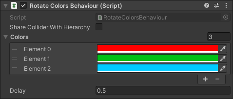
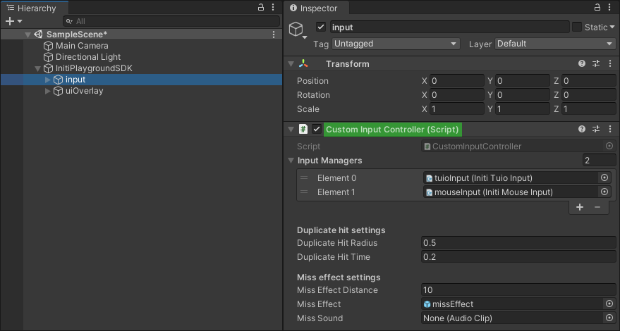

Title:   Extending functinality
Summary: How to create new behaviour scripts
Authors: Ondrej Prucha
Date:    August 25, 2024
blank-value:

# Extending functionality

## Adding custom interactive objects

To create custom interactive objects with unique behaviors, you’ll need to extend the `BaseHittable` class, the base class of all interactive objects in INITI Playground. By extending `BaseHittable`, you can implement your own logic that responds to hits or touches, giving you complete control over how your objects react to user interactions.

This flexibility allows you to create everything from simple reactions to complex sequences of events, tailored specifically to your game's needs. If you want to add custom animations, trigger specific audio effects, or implement gameplay mechanics, you will need to extend `BaseHittable` class and override the `Hit(Vector3 hitPosition)` method.

### Example 

In the following example, we'll explore how to create a custom behavior that takes a list of colors as a parameter and changes the `SpriteRenderer`'s color to the next one in the list each time the object is hit.

1. First, right-click in the **Project window**, and select **Create > C# Script** to create a new script. Name the script **RotateColorsBehaviour**
1. Now we need to extend the `BaseHittable` class, which is the base class for all interactive objects and override the `Hit(Vector3 hitPosition)` method.
``` c# linenums="1"
using initi.behaviour;
using UnityEngine;

public class RotateColorsBehaviour : BaseHittable
{
    // Start is called before the first frame update
    void Start()
    {
        
    }

    public override void Hit(Vector3 hitPosition)
    {
        base.Hit(hitPosition);
    }
}
```
1. Now, we can start implementing our custom logic. Let's begin by adding some properties our script will use.
``` c# linenums="1"
public class RotateColorsBehaviour : BaseHittable
{
    public List<Color> colors;
    public float delay = 0.5f;
    private int currentColor = 0;
    private float lastTouchTime = 0f;
    private SpriteRenderer spriteRenderer;

    ...
}
```
      - **colors** - A `List` that will store the colors that the `SpriteRenderer` will cycle through each time the object is hit.
      - **delay** - Sets the minimum time between hits. The script will check if enough time has passed since the last hit before processing the next one. If the object is hit too quickly (before the delay time has elapsed), the hit will be ignored.
      - **currentColor** - The index of the currently selected color.
      - **lastTouchTime** - The last time object was hit.
      - **spriteRenderer** - Reference to `SpriteRenderer` component.
1. Next, we’ll assign the reference to the `SpriteRenderer` component to our property. Since this script relies on the `SpriteRenderer` being attached to the object, it’s a good practice to include the `RequireComponent` attribute. This way, Unity will automatically add a `SpriteRenderer` to the object when you attach this script.
``` c# linenums="1" hl_lines="1 9"
[RequireComponent(typeof(SpriteRenderer))]
public class RotateColorsBehaviour : BaseHittable
{
    ...

    // Start is called before the first frame update
    void Start()
    {
        spriteRenderer = GetComponent<SpriteRenderer>();
    }

    ...
}

```
1. If the color list isn't empty, we'll initialize the `SpriteRenderer`'s color to the first color in the list when the script starts.
``` c# linenums="1" hl_lines="10"
[RequireComponent(typeof(SpriteRenderer))]
public class RotateColorsBehaviour : BaseHittable
{
    ...

    // Start is called before the first frame update
    void Start()
    {
        spriteRenderer = GetComponent<SpriteRenderer>();
        if(colors.Count > 0) spriteRenderer.color = colors[currentColor];
    }

    ...
}

```
1. Now that everything is set up, we can implement our custom logic in the `Hit` method we overrode earlier.
``` c# linenums="1"
[RequireComponent(typeof(SpriteRenderer))]
public class RotateColorsBehaviour : BaseHittable
{
    ...

    public override void Hit(Vector3 hitPosition)
    {
        base.Hit(hitPosition);
        if (Time.time > (lastTouchTime + delay))
        {
            currentColor++;
            if(currentColor >= colors.Count) currentColor = 0;
            spriteRenderer.color = colors[currentColor];
            lastTouchTime = Time.time;
        }
    }
}

```
     - The condition `if (Time.time > (lastTouchTime + delay))` checks if enough time has passed since the last hit. **Time.time** gives the current time in seconds since the start of the game. If the current time is greater than the time of the last touch plus the specified delay, the hit will be processed. This ensures that hits occurring too close together (within the delay period) are ignored.
     - Next, we increment the `currentColor` index, which keeps track of the current color in the colors list. If the index reaches the end of the list (i.e., it's greater than or equal to the number of colors), it resets to 0, cycling back to the first color.
     - The `spriteRenderer`'s color is updated to the new color selected from the colors list based on the `currentColor` index.
     - Lastly, the `lastTouchTime` variable is updated to the current time, marking when the last valid hit occurred. This ensures that the delay logic works correctly for subsequent hits.
1. Here is the complete code:
``` c# linenums="1"
using initi.behaviour;
using System.Collections.Generic;
using UnityEngine;

[RequireComponent(typeof(SpriteRenderer))]
public class RotateColorsBehaviour : BaseHittable
{
    public List<Color> colors;
    public float delay = 0.5f;
    private int currentColor = 0;
    private float lastTouchTime = 0f;
    private SpriteRenderer spriteRenderer;

    // Start is called before the first frame update
    void Start()
    {
        spriteRenderer = GetComponent<SpriteRenderer>();
        if(colors.Count > 0) spriteRenderer.color = colors[currentColor];
    }

    public override void Hit(Vector3 hitPosition)
    {
        base.Hit(hitPosition);
        if (Time.time > (lastTouchTime + delay))
        {
            currentColor++;
            if(currentColor >= colors.Count) currentColor = 0;
            spriteRenderer.color = colors[currentColor];
            lastTouchTime = Time.time;
        }
    }
}

```
1. Your new behavior is now ready for use in the game. Attach the script to your `GameObject`, populate the color list, and observe how the color changes with each hit. Be sure to also add a `Collider` or `Collider2D` component to the object, so it can respond to hits.
   {: .center }


<br />

**That's it! As you can see, adding interactive objects with custom logic is straightforward. This example is very simple, but with this foundation, you're well-equipped to create interactive objects with more complex behaviors. Experiment with different ideas and expand upon this to fit the needs of your project.**


## Extending `Initi Input Controller`

The `Initi Input Controller` manages inputs from various sources, such as mouse clicks or touch events, and relays hit events to interactive objects. If a hit is detected but no interactive object is present at the hit location, the `MissRegistered` method is triggered. For detailed information about configuring the `Initi Input Controller`, please refer to the [Setting up a new project](unity-setting-up-project.md#add-initi-playground-sdk-to-the-scene) section of this documentation. In this section, we will explore how to implement custom logic for handling hits or misses.

### Custom **hit** logic

In this example, we will extend the `Initi Input Controller` and override the `HitRegistered` method to track the number of hits. This approach can serve as a simple implementation of a scoring system or any other functionality that depends on counting hits.

1. Right-click in the **Project window**, and select **Create > C# Script** to create a new script. Name the script **CustomInputController**.
1. Extend the `InitiInputController` class and override the `HitRegistered(GameObject hitObject, Vector3 hitPosition)` method method to implement our custom hit logic.
``` c# linenums="1"
using initi.input;
using UnityEngine;

public class CustomInputController : InitiInputController
{
    public override void HitRegistered(GameObject hitObject, Vector3 hitPosition)
    {
        base.HitRegistered(hitObject, hitPosition);
    }
}
```
> It's important to include a call to `base.HitRegistered(hitObject, hitPosition);` within the method to ensure that the base input functionality is preserved.
1. Now, we can proceed with implementing the hit counter logic.
``` c# linenums="1"
public class CustomInputController : InitiInputController
{
    private int touchCount = 0;

    public override void HitRegistered(GameObject hitObject, Vector3 hitPosition)
    {
        base.HitRegistered(hitObject, hitPosition);
        touchCount++;
        Debug.Log("Touches registered: " + touchCount);
    }

    public int GetTouchCount()
    {
        return touchCount;
    }
}
```
1. **That's it!** Our `CustomInputController` now tracks the number of successful hits and includes a getter method to access this count, which can be useful for example for displaying score in a UI. The final step is to replace the default `InitiInputController` with our custom version to ensure our new logic is in use. <br />   
    {: .center } <br />
1. When you run the scene and interact with any behavior, you should see the hit count increase, which will be displayed in the console.

### Custom **miss** logic

Creating custom logic for misses follows the same approach as for hits. The only difference is that you need to override the `MissRegistered(Ray ray)` method instead of `HitRegistered(GameObject hitObject, Vector3 hitPosition)`. The code below demonstrates how to implement a miss counter, similar to the hit counter example.

``` c# linenums="1"
using initi.input;
using UnityEngine;

public class CustomInputController : InitiInputController
{
    private int missCount = 0;

    public override void MissRegistered(Ray ray)
    {
        base.MissRegistered(ray);
        missCount++;
        Debug.Log("Misses registered: " + missCount);
    }

    public int GetMissCount()
    {
        return missCount;
    }
}
```

Creating custom miss logic can be useful if you want to replace the default effects or sounds with more dynamic responses. For instance, you can implement multiple effects or sounds that are randomly selected when a miss occurs, adding variety and enhancing the user experience.

----

With this knowledge, you're ready to begin developing your games for INITI Playground. If you have any questions or need assistance, please don't hesitate to reach out via the [contact form](../help/contact.md) in the **Help** section. In the next part of this documentation, we'll cover how to install and uninstall your custom games to INITI Playground so you can start playing them.


<br />

<div class="center" markdown>
[Installing games to INITI Playground](installing-games.md){ .md-button }
</div>

<br />