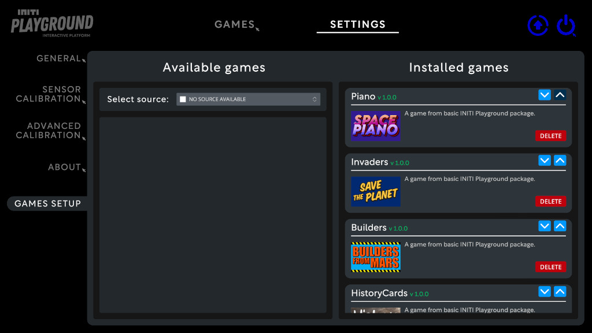
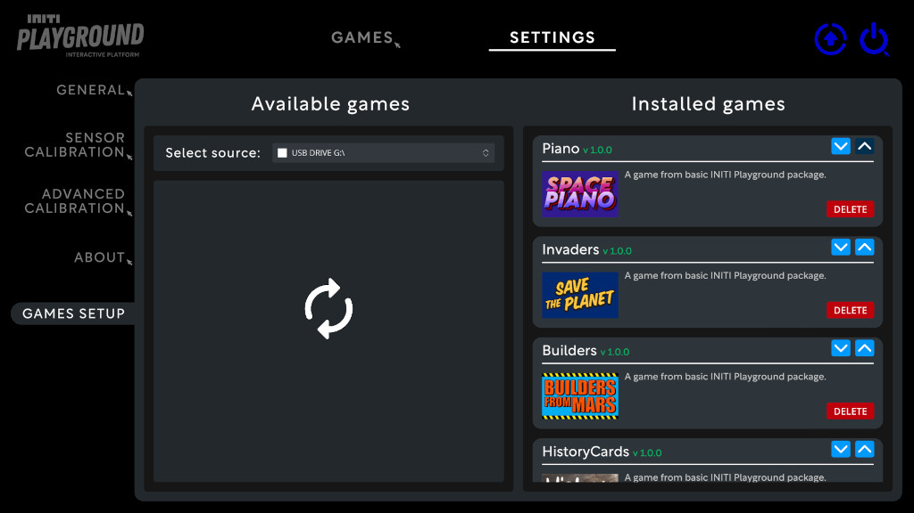
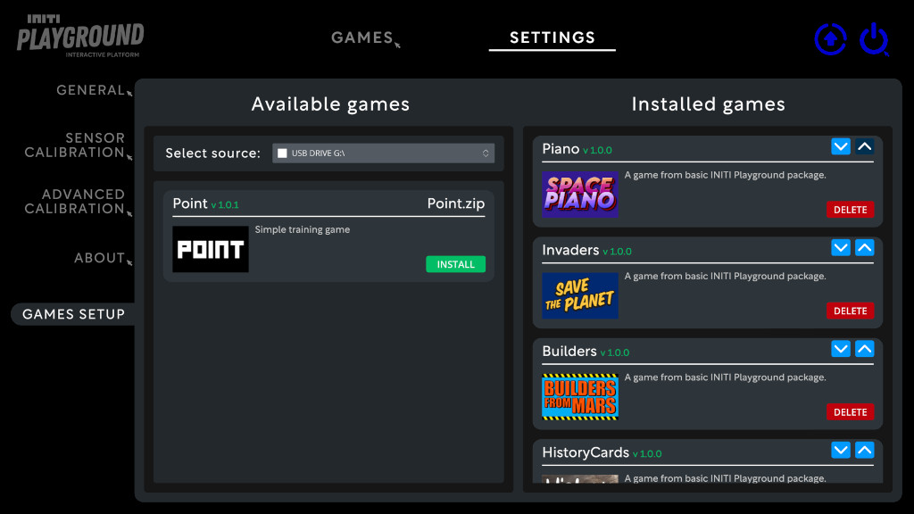
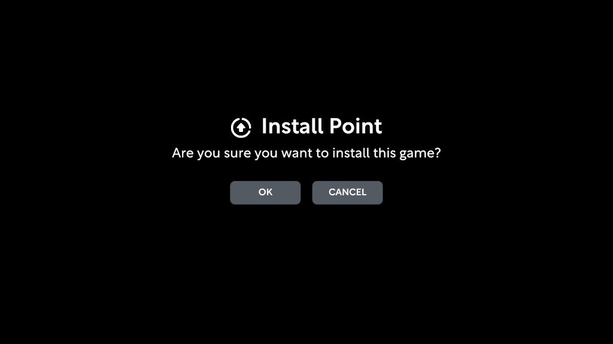
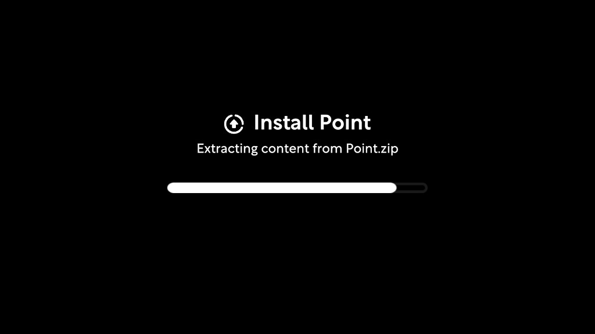
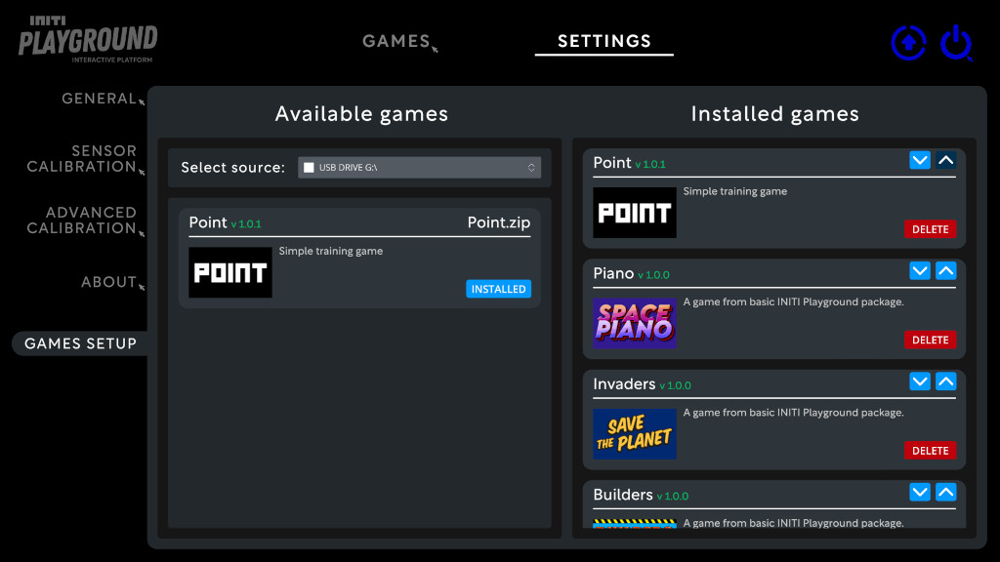
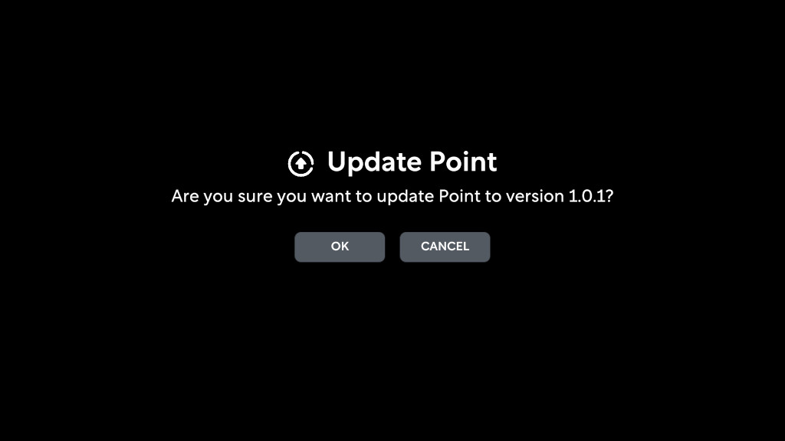

Title:   Installing custom games
Summary: How to install custom games and use them in INITI Playground
Authors: Ondrej Prucha
Date:    September 5, 2024
blank-value:

# Installing games on INITI Playground

This guide will walk you through the process of installing a game on INITI Playground using a USB drive.

## Video guide

- For a quick start, check out our video guide:
  
    <br />
    <div class="center imageWidth" markdown>
    <div style="padding:56.25% 0 0 0;position:relative;">
    <iframe src="https://player.vimeo.com/video/1087815636?h=7847542ed9&amp;badge=0&amp;autopause=0&amp;player_id=0&amp;app_id=58479" frameborder="0" allow="autoplay; fullscreen; picture-in-picture; clipboard-write" style="position:absolute;top:0;left:0;width:100%;height:100%;" title="INITI Playground - Adding your own content to the game console"></iframe></div>
    <script src="https://player.vimeo.com/api/player.js"></script>
    </div>
    <br />


## Prerequisites

Before installing the game, ensure you have completed the following steps:

- Prepared the game ZIP file by following the [this guide](preparing-games.md).
- Copied the ZIP file to a USB drive.
- Updated INITI Playground to version 1.0.7 or higher.

## Installing games

- Open the UI and click on the `Settings` tab at the top of the screen. Locate the games setup section, as illustrated in the picture below.

    <div class="center imageWidth" markdown>
    
    </div>

- Connect your USB drive to the INITI Playground computer.
- Wait a few seconds for the system to recognize the USB drive.
- The system will automatically detect the drive and begin loading the list of available games.
  
    <div class="center imageWidth" markdown>
    
    </div>

- Once the list is loaded, you will see the games available for installation in the `Available Games` panel on the left.

    <div class="center imageWidth" markdown>
    
    </div>

- Locate your game in the list. 
 
    !!! note 
        If your game does not appear, check the [Preparing Games for INITI Playground Guide](preparing-games.md).

- Select your game and click the `Install` button.

    <div class="center imageWidth" markdown>
    
    </div>

- Confirm installation and wait for the installation process to complete

    <div class="center imageWidth" markdown>
    
    </div>

- Once the installation is complete, the game will appear in the `Installed games` panel on the right and the game in `Available games` panel is marked as `INSTALLED`.

    <div class="center imageWidth" markdown>
    
    </div>


## Updating games

- Updating a game works similarly to installing a new one, but with the added convenience of replacing the previous version. If a newer version of the game is found on the USB drive compared to the one currently installed, an `Update` button will appear, allowing you to quickly install the latest version while removing the old one, as shown in the following picture.

    <div class="center imageWidth" markdown>
    
    </div>

    <div class="center" markdown>
        ```Please note that the available game version is 1.0.1, while the currently installed version is 1.0.0.```
    </div>

- To update, simply click the `Update` button and confirm. The previous version will be automatically uninstalled, and the new version will be installed in its place.
    
    <div class="center imageWidth" markdown>
    
    </div>


In the following section, we will cover how to remove games from INITI Playground.

<br />

<div class="center" markdown>
[Uninstalling games from INITI Playground](uninstalling-games.md){ .md-button }
</div>

<br />
