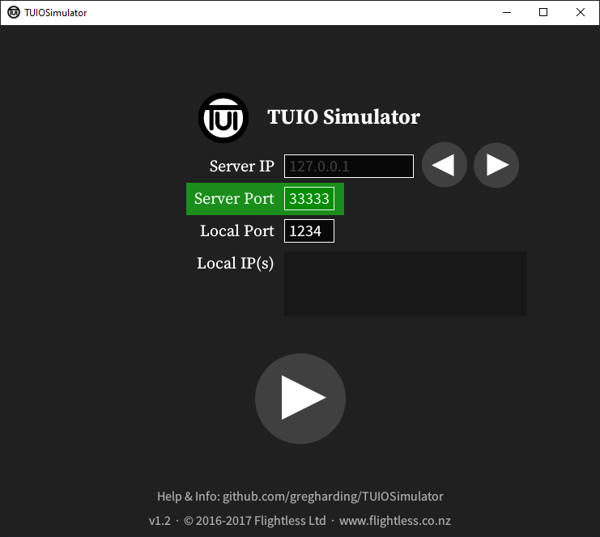
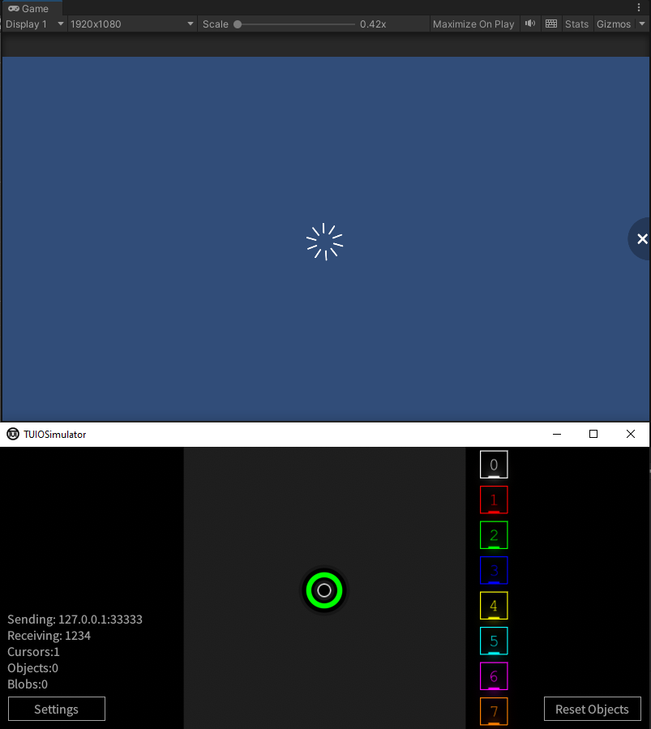

Title:   Testing touch using simulator
Summary: Using TUIO simulator for testing touch
Authors: Ondrej Prucha
Date:    August 2, 2024
blank-value:

# Testing touch using simulator

While testing input using the mouse directly from the editor is convenient, it's also good practice to periodically test native input with a simulator. A simulator is an external application that emulates native touches, allowing you to test how INITI Playground responds as if the touches were coming from the sensor. Since INITI Playground uses the TUIO protocol for communication with the touch sensor, any TUIO-compatible simulator should work. For this documentation, we will use <a href="https://github.com/gregharding/TUIOSimulator" target="_blank">Greg Harding's Unity/C# implementation</a> as our example.

## Download TUIO simulator

- Visit the <a href="https://github.com/gregharding/TUIOSimulator" target="_blank">GitHub repository</a> for the TUIO simulator by Greg Harding.
- Navigate to the Releases section.
- Download and unzip the latest release for your OS (`TUIOSimulator_v1.2_win_x86_64.zip` if you are using Windows)

## Simulator settings

- Run the application (`TUIOSimulator.exe` on Windows)
- The only setting that needs adjustment from the default is the server port. Since INITI Playground's games are configured to listen on port `33333`, make sure to set the server port to this number.

{: .center }

## Using simulator

- Once you’ve set the server port correctly, click the big **Play** button in the center of the simulator window.
- In Unity, enter Play mode by clicking the **Play** button.
- In TUIO Simulator, click anywhere in the gray area in the center. You should see the touch registered in Unity, with the miss effect spawning as a result.
 
    !!! note 
        If Unity doesn't register the touches from the simulator, double-check that the port number is set correctly and that **Run In Background** is enabled in the [Project Settings](unity-setting-up-project.md#project-settings).

{: .center }

 

----

[Adding interactive objects](adding-interactive-objects.md){ .md-button }

 