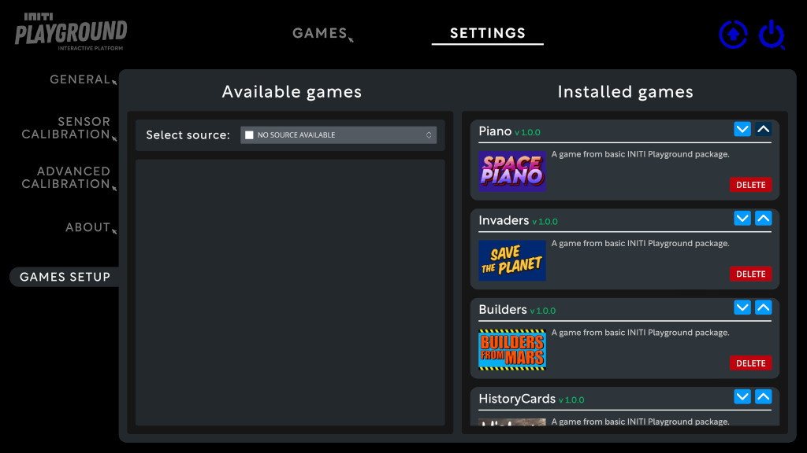

Title:   Uninstalling custom games
Summary: How to uninstall custom games in INITI Playground
Authors: Ondrej Prucha
Date:    September 5, 2024
blank-value:

# Uninstalling games from INITI Playground

If you wish to remove any games from INITI Playground, this guide will walk you through the process.

- Open the UI and click on the `Settings` tab at the top of the screen. Locate the games setup section, as illustrated in the picture below.

    

    
    

- Find the game you wish to remove in the `Installed games` panel on the right side, then click `Delete` button.
- Confirm and wait for the game to be removed

    

    
    

    

    
    

- Once the game is uninstalled, it will no longer appear in the `Installed games` list.