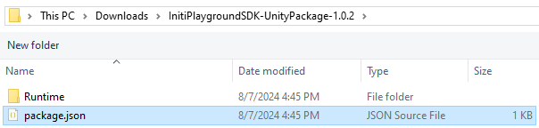

Title:   INITI Playground SDK for Unity
Summary: Download INITI Playground SDK for Unity
Authors: Ondrej Prucha
Date:    July 29, 2024
blank-value:


# Download INITI Playground SDK for Unity

The INITI Playground SDK is available as a package for the Unity engine on our [GitHub page](https://github.com/INITI-Playground/INITIPlaygroundSDK-UnityPackage). To get started, you will need to add it to your project using the Unity Package Manager.

## Adding package from git URL

!!! success "Prerequisites"

    To use Git packages in a project, Git must be installed on the user machine. The Git executable path should be listed in the PATH system environment variable.

- Open Package Manager (`Window > Package Manager`)
- Click the plus icon located at the top left corner and elect `Add package from git URL...`

{: .center }

- Paste the git URL and click `Add`

```
https://github.com/INITI-Playground/INITIPlaygroundSDK-UnityPackage.git
```

- Unity will download the package and add it into your project

{: .center }

--------

## Adding package from disk

- Visit our [GitHub repository](https://github.com/INITI-Playground/INITIPlaygroundSDK-UnityPackage)
- Navigate to the Releases section.
- Download and unzip the latest release

{: .center }

- Open Package Manager (`Window > Package Manager`)
- Click the plus icon located at the top left corner and elect `Add package from disk...`
- Locate the `package.json` file and click `Open`

{: .center }

- Unity will add the package into your project

{: .center }

<br />

Now that you have added the INITI Playground package to your project, let's begin the setup

----


<div class="center" markdown>
[Setting up a new project](unity-setting-up-project.md){ .md-button }
</div>

<br />