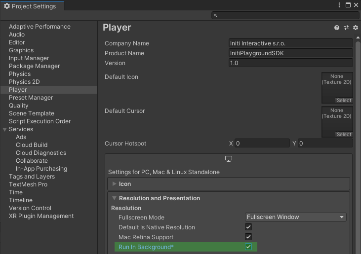
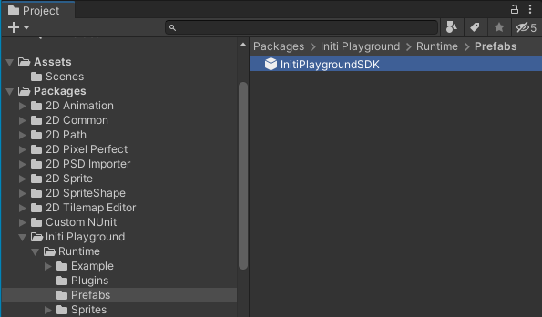
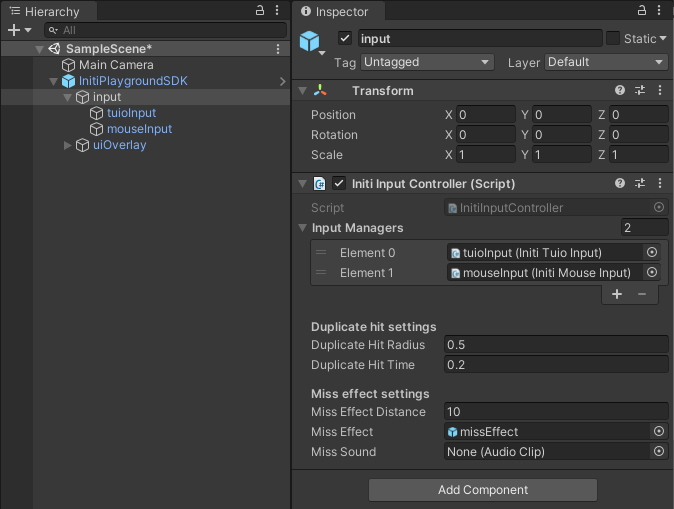
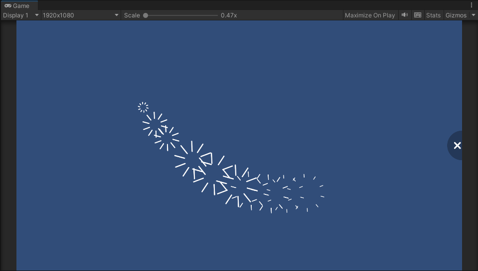
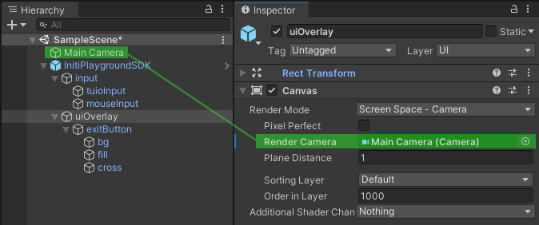
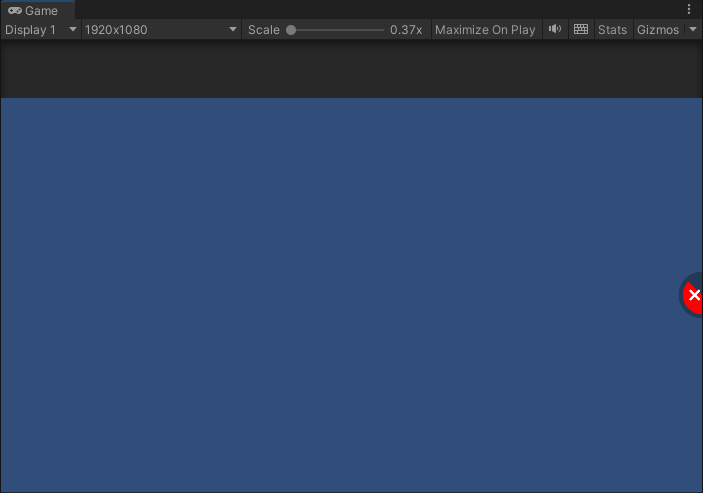

Title:   Setting up a new project
Summary: Set up a new project in Unity using Initi Playground SDK
Authors: Ondrej Prucha
Date:    July 30, 2024
blank-value:

# Setting up a new project

!!! success "Prerequisites"

    Ensure you have completed the [SDK installation guide](unity-sdk-download.md) and added the Initi Playground package to your project.

## Project settings

The first step is to ensure that the Player runs in the background, which is especially useful for testing input with a simulator. To enable this, go to `Edit > Project Settings`, then navigate to the `Player` tab, and make sure the `Run In Background` option is checked.

{: .center }

## Add Initi Playground SDK to the scene

- Find the Initi Playground SDK prefab in `Packages > Initi Playground > Runtime > Prefabs`, then drag and drop it into the scene.

{: .center }

- In the `Hierarchy` window, select the `input` GameObject within the main `InitiPlaygroundSDK` GameObject. Customize the properties of the `Initi Input Controller` according to your preferences.

{: .center }

|                 |                                                   |
| --------------- | ------------------------------------------------- |
| **Input Managers** | This is a list of Initi Input objects that are registered as input data providers. By default, the project is configured with TUIO input, which handles touch data from the sensor, and mouse input for testing purposes. If you prefer the game not to be controlled by the mouse, you can remove the `Initi Mouse Input` from this list. |
| **Duplicate Hit Radius** | A hit is considered a duplicate and is ignored if multiple hits occur within the same radius and time frame. The radius is defined in world units.  |
| **Duplicate Hit Time** | A hit is considered a duplicate and is ignored if multiple hits occur within the same radius and time frame. The time is defined in second.  |
| **Miss Effect Distance** | Specifies the distance from the camera where the miss effect will be spawned. This setting is particularly useful when using a perspective camera. |
| **Miss Effect** | Default effect prefab to be spawned on touch if player didnt hit any other object.  |
| **Miss Sound** | Default effect sound to be played on touch if player didnt hit any other object.  |

After adding the `InitiPlaygroundSDK` prefab to your scene, touch functionality is enabled automatically. You can test this in **Play mode**. Since no interactive objects are present yet, clicking anywhere in the scene triggers a default miss effect prefab. Experiment with the `Initi Input Controller` properties for duplicate hit and miss effect settings to observe how these adjustments influence input behavior.

{: .center }

## Enable exit button

The final step is to enable the Exit Button. Since the Exit Button is rendered on the `UI` layer using a `Screen Space - Camera` canvas, you'll need to assign your Camera to the Canvas.

- In the `Hierarchy` window, select the `uiOverlay` GameObject within the main `InitiPlaygroundSDK` GameObject.
- Assign your Camera to the Canvas using `Inspector`

{: .center }

- You can now test the Exit Button in **Play mode**. It should function correctly when clicked. To prevent accidental exits, you'll need to hold the button for about 2 seconds until it triggers and closes the game. During this time, the Exit Button will display a red fill to indicate the countdown. 

    !!! note
        Please note that to fully test the exit functionality, you must build the game, as it cannot be tested within the editor.

{: .center }

 

----

[Testing touch using simulator](testing-touch-using-simulator.md){ .md-button }

 