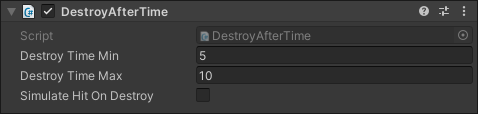
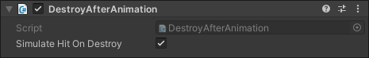
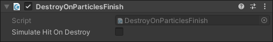
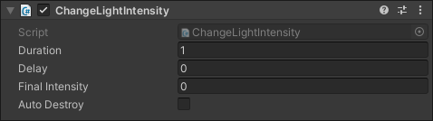
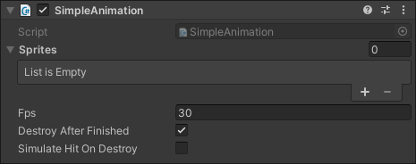

Title:   Utility scripts
Summary: A closer look at utility scripts
Authors: Ondrej Prucha
Date:    August 25, 2024
blank-value:

# Pre-made utility scripts

Utility scripts are designed to manage the lifecycle of objects spawned through behavior scripts. While many of these scripts are intuitive, we'll provide a closer look at each one to help you understand their functionality and applications. You can find these utility scripts under `Initi > Behaviour > Utils`.

## Destroy After Time

The `Destroy After Time` script is used to automatically remove a `GameObject` after a specified duration. This script is useful for managing the lifespan of temporary objects, such as effects or projectiles, that should not persist indefinitely in your scene.

{: .center }

|                                   |                                                   |
| --------------------------------- | ------------------------------------------------- |
| **Destroy Time Min** | The minimum time (in seconds) that the `GameObject` will remain in the scene before it is eligible for destruction. This parameter sets the lower bound for the destruction timer, ensuring that the object is not destroyed before this minimum duration has passed. The object's actual destruction time will be randomly selected between the `Destroy Time Min` and `Destroy Time Max` values, providing a controlled range for how long the object remains active. |
| **Destroy Time Max** | The maximum time (in seconds) before the `GameObject` is automatically destroyed. This sets the upper limit of the object's lifespan, ensuring it will not persist beyond this duration. The object's actual destruction time will be randomly selected between the `Destroy Time Min` and `Destroy Time Max` values, providing a controlled range for how long the object remains active. |
| **Simulate Hit On Destroy** |  When enabled, it triggers a simulated hit event on the `GameObject`'s behaviors and those of its child objects just before the `GameObject` is destroyed. This allows any attached behaviors to react as if the object was interacted with by the user, even though it is about to be removed from the scene. |

## Destroy After Animation

This utility script retrieves the duration of the current animation from the `Animator` component and destroys the `GameObject` once the animation completes. It requires an `Animator` component to be attached to the same `GameObject`.

{: .center }

|                                   |                                                   |
| --------------------------------- | ------------------------------------------------- |
| **Simulate Hit On Destroy** |  When enabled, it triggers a simulated hit event on the `GameObject`'s behaviors and those of its child objects just before the `GameObject` is destroyed. This allows any attached behaviors to react as if the object was interacted with by the user, even though it is about to be removed from the scene. |

## Destroy When Invisible

This script automatically deletes the `GameObject` when it becomes invisible. It flags the object as visible when `OnBecameVisible()` is called and destroys it when `OnBecameInvisible()` is triggered. This is particularly useful for managing objects with physics or gravity that fall out of view.

## Destroy On Particles Finish

This script manages the lifecycle of a `GameObject` by waiting for all `Particle Systems` on the object and its children to complete their emission. Once all particles have ceased, the script automatically destroys the `GameObject`.

{: .center }

|                                   |                                                   |
| --------------------------------- | ------------------------------------------------- |
| **Simulate Hit On Destroy** |  When enabled, it triggers a simulated hit event on the `GameObject`'s behaviors and those of its child objects just before the `GameObject` is destroyed. This allows any attached behaviors to react as if the object was interacted with by the user, even though it is about to be removed from the scene. |

## Don't Destroy On Scene Load

This helper component marks the `GameObject` to persist through scene reloads by calling the `DontDestroyOnLoad()` method.

## Change Light Intensity

This component animates the light intensity over time. Optionally, it can destroy the `GameObject` once the animation ends. It's useful for effects that require a fading light effect, allowing them to be removed from the scene once the fade is complete.

{: .center }

|                                   |                                                   |
| --------------------------------- | ------------------------------------------------- |
| **Duration** | Specifies the duration (in seconds) for which the light intensity will be animated. |
| **Delay** | Specifies the delay (in seconds) before the light intensity animation begins. |
| **Final Intensity** | Defines the target intensity value that the light will animate towards over the specified duration. |
| **Auto Destroy** | If enabled, the `GameObject` will be automatically destroyed once the light intensity animation completes. This is useful for automatically removing objects after they have finished their visual effect. |

## Simple Animation

A utility script that animates a sequence of sprites at a specified frame rate. With the option to destroy the `GameObject` once the animation is complete, it’s ideal for simple sprite sheet effects that can be instantiated and left to run without further management.

{: .center }

|                                   |                                                   |
| --------------------------------- | ------------------------------------------------- |
| **Sprites** | A list of sprites that will be played in sequence to create the animation.  |
| **Fps** | The frames per second at which the sprites are played, determining the speed of the animation.  |
| **Destroy After Finish** | If enabled, the GameObject will be automatically destroyed after the sprite animation completes.  |
| **Simulate Hit On Destroy** |  When enabled, it triggers a simulated hit event on the `GameObject`'s behaviors and those of its child objects just before the `GameObject` is destroyed. This allows any attached behaviors to react as if the object was interacted with by the user, even though it is about to be removed from the scene. |

Combined with the pre-made behaviors, these utility scripts will help you quickly set up a simple, game-ready environment in **Initi Playground**. In the next section, we’ll explore how you can extend this functionality by implementing interactive objects with custom logic.

 

----

[Extending functionality](extending-behaviors.md){ .md-button }

 