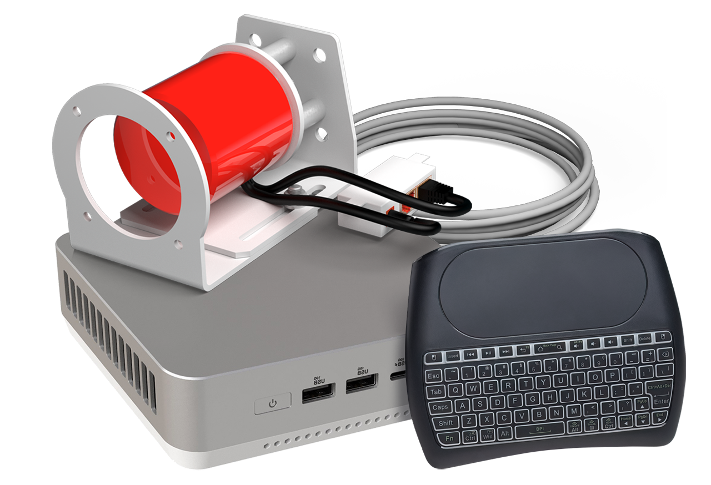

Title:   Get help
Summary: Search through FAQ or contact us for more help
Authors: Ondrej Prucha
Date:    March 3, 2026
blank-value:

# Getting Help

If you need assistance with your INITI Playground, there are several ways to find support.

## Frequently Asked Questions

Start by browsing our [Frequently Asked Questions](faq.md). This section covers common issues, setup guidance, and troubleshooting tips, allowing you to resolve most questions independently.

## Contacting Support

If your question isn’t addressed in the [FAQ](faq.md), you can reach out to our team directly through the [contact form](contact.md). Provide details about your issue or inquiry, and we will respond as soon as possible.

!!! tip "Pro advice"
    When contacting support, include your system version and a brief description of the issue. This helps us provide faster and more precise assistance.

----

[Frequently Asked Questions](faq.md){ .md-button }

 