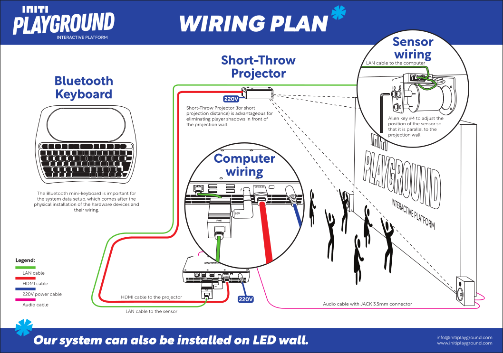

Title:   Computer installation
Summary: Connection the computer to sensor and projector
Authors: Ondrej Prucha
Date:    July 25, 2024
blank-value:

# Wiring guide

In this section, you'll find a video that demonstrates how to properly connect the sensor, projector, sound system, and other necessary components to your computer, ensuring that everything is set up to start the INITI Playground. Check the video below for a step-by-step visual guide. If you encounter any issues, feel free to [contact us](../help/contact.md) for support.

<iframe src="https://player.vimeo.com/video/1002096221?h=e261eb1fbd&amp;badge=0&amp;autopause=0&amp;player_id=0&amp;app_id=58479" frameborder="0" allow="autoplay; fullscreen; picture-in-picture; clipboard-write" style="position:absolute;top:0;left:0;width:100%;height:100%;" title="INITI Playground - Gaming console, WIRING"></iframe>

