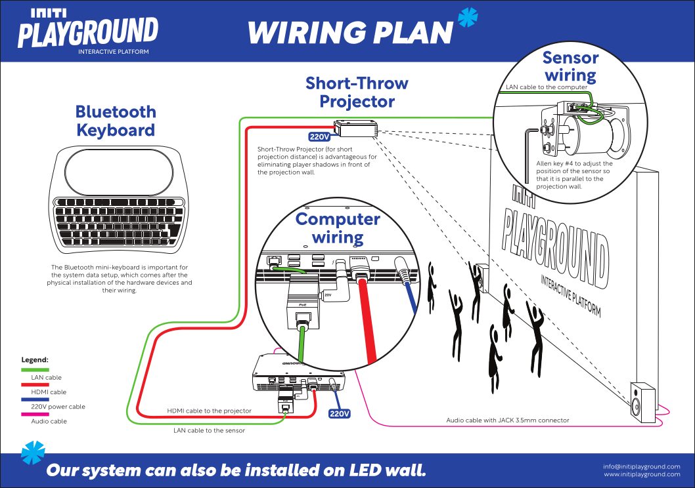

Title:   Computer installation
Summary: Connection the computer to sensor and projector
Authors: Ondrej Prucha
Date:    March 3, 2026
blank-value:

# Wiring guide

After mounting all hardware components, the next step is connecting the system correctly. Proper wiring ensures reliable communication between the sensor, projector, audio system, and the INITI Playground computer.

In the video below, you’ll find a complete step-by-step demonstration showing how to connect:

- the **INITI Playground media server**,
- the **touch sensor** and PoE injector,
- the **projector**,
- the **audio output / speakers**,
- and all required power connections.

Before powering on the system, make sure all cables are connected according to the wiring plan shown below.

{ .on-glb } 

!!! tip "Installation recommendation"
    Route cables along walls or truss structures and secure them properly to prevent accidental disconnection or tripping hazards in public spaces.

For a full visual walkthrough, watch the video below.  
If you experience any issues during installation, feel free to [contact us](../help/contact.md) — we’re happy to help.

<iframe src="https://player.vimeo.com/video/1002096221?h=e261eb1fbd&amp;badge=0&amp;autopause=0&amp;player_id=0&amp;app_id=58479" frameborder="0" allow="autoplay; fullscreen; picture-in-picture; clipboard-write" style="position:absolute;top:0;left:0;width:100%;height:100%;" title="INITI Playground - Gaming console, WIRING"></iframe>

