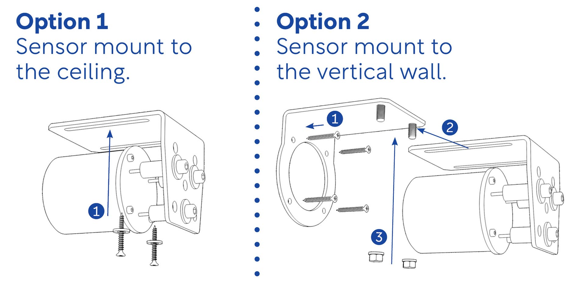
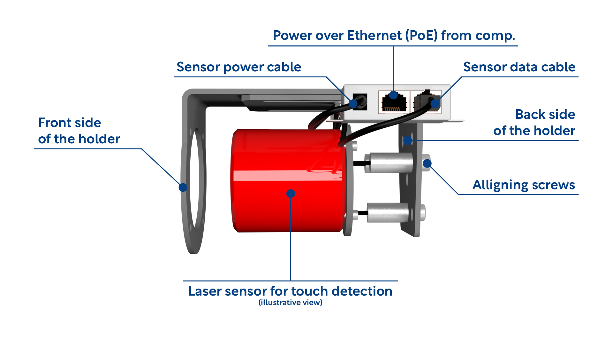

Title:   Sensor installation
Summary: Mounting the sensor to the wall
Authors: Ondrej Prucha
Date:    July 25, 2024
blank-value:

# Sensor installation

There are two ways to install the INITI Playground sensor: mounting it to the ceiling or to the wall. Depending on your space, you can choose the method that works best for you:

1. **Mounting the sensor on the ceiling**
      - Remove the front part of the sensor holder.
      - Attach the remaining part of the holder to the ceiling using screws and dowels.

1. **Mounting the sensor to the wall**
      - First, screw the front part of the holder directly to the wall.
      - Secure the rest of the holder to the front part using two nuts and tighten them firmly.

------------

---------

-----------

In both cases, ensure that the top of the sensor is approximately 3 cm from the projection wall. The sensor uses an invisible laser beam that should rotate as parallel as possible to the wall for optimal performance.

!!! custom-tip "Note"
    If the sensor becomes misaligned during installation, use an Allen key #5 to adjust the front screws of the holder. Rotate the screws until the sensor is horizontal and aligned with the wall. You can check the sensor's balance in the `Sensor Calibration` section under `Settings`.

For a visual guide, please refer to the video below.

<iframe src="https://player.vimeo.com/video/796039598?h=f8dad1db6a&amp;badge=0&amp;autopause=0&amp;player_id=0&amp;app_id=58479" frameborder="0" allow="autoplay; fullscreen; picture-in-picture; clipboard-write" style="position:absolute;top:0;left:0;width:100%;height:100%;" title="INITI Playground - Sensor installation"></iframe>

 

!!! custom-tip "Final tip"
    To ensure the sensor detection surface is level and covers the entire projection wall, align the sensor by first using the screws to get the blue sensor line to a horizontal position. Then, use only the bottom screw to shift the blue line down, positioning the sensor's detection surface 5-10 cm above the entire projection area.

----

[Wiring guide](computer-installation.md){ .md-button }

 