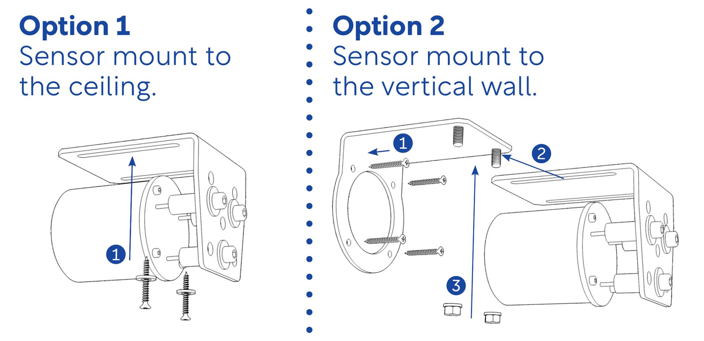
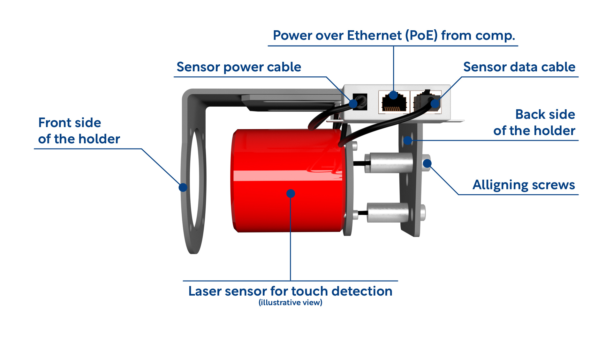

Title:   Sensor installation
Summary: Mounting the sensor to the wall
Authors: Ondrej Prucha
Date:    July 25, 2024
blank-value:

# Sensor installation

The INITI Playground sensor can be installed either on the **ceiling** or directly on the **wall**, depending on your installation environment. Both methods provide reliable tracking when the sensor is correctly aligned.

## Mounting options

### Ceiling mounting

Ceiling mounting typically provides the best results because the sensor remains protected and centered above the projection area.

- Remove the **front part** of the sensor holder.
- Attach the remaining holder base to the ceiling using appropriate screws and wall plugs.

### Wall mounting

Wall mounting is suitable when ceiling installation is not possible.

- Attach the **front part** of the holder directly to the wall.
- Connect the rest of the holder to the mounted front part.
- Secure both parts together using the two supplied nuts and tighten them firmly.

---

{ .on-glb } 

---

{ .on-glb } 

---

## Sensor positioning

For proper operation, correct positioning is critical:

- The **top edge of the sensor** should be approximately **3 cm away from the projection wall**.
- The sensor emits an invisible laser scanning line that should rotate **as parallel to the wall as possible**.
- Ideally, position the sensor **centrally above the projection area** for the most consistent tracking results.

!!! custom-tip "Alignment adjustment"
    If the sensor becomes misaligned during installation, use an **Allen key #5** to adjust the front screws of the holder. Rotate the screws until the sensor is level and aligned with the wall. You can verify alignment later in the **Sensor Calibration** section under `Settings`.

## Alignment recommendation

!!! custom-tip "Final tip"
    To ensure the detection surface covers the entire projection area:
    
    - First, adjust the screws until the **blue sensor line appears horizontal**.
    - Then use only the **bottom adjustment screw** to move the line vertically.
    - Position the detection line approximately **5–10 cm above the top edge of the projection area**.

This ensures reliable detection of touches and soft ball impacts across the entire wall.

For a complete visual walkthrough of the installation process, watch the video below.

<iframe src="https://player.vimeo.com/video/796039598?h=f8dad1db6a&amp;badge=0&amp;autopause=0&amp;player_id=0&amp;app_id=58479" frameborder="0" allow="autoplay; fullscreen; picture-in-picture; clipboard-write" style="position:absolute;top:0;left:0;width:100%;height:100%;" title="INITI Playground - Sensor installation"></iframe>

 

----

[Wiring guide](computer-installation.md){ .md-button }

 