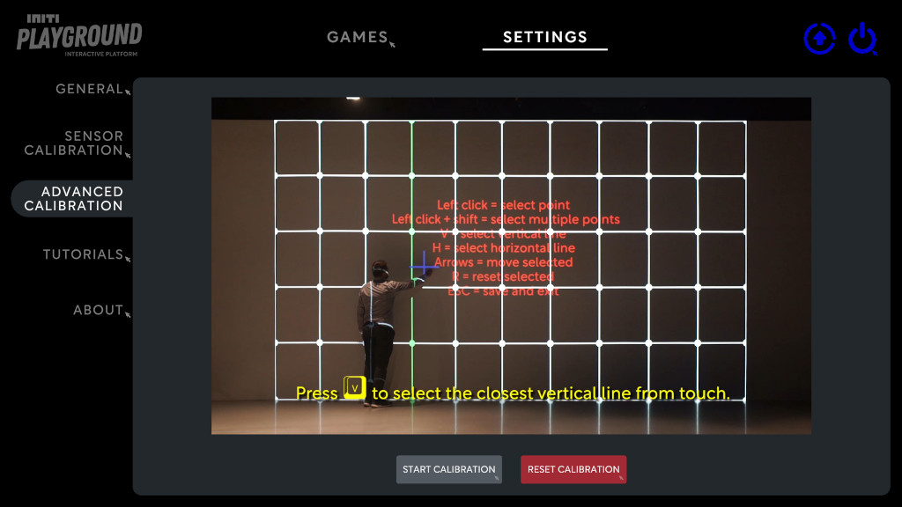
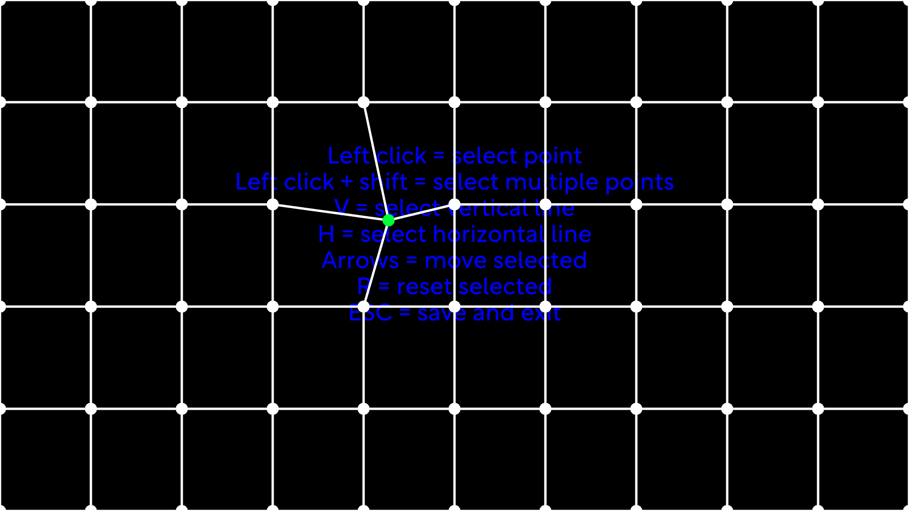
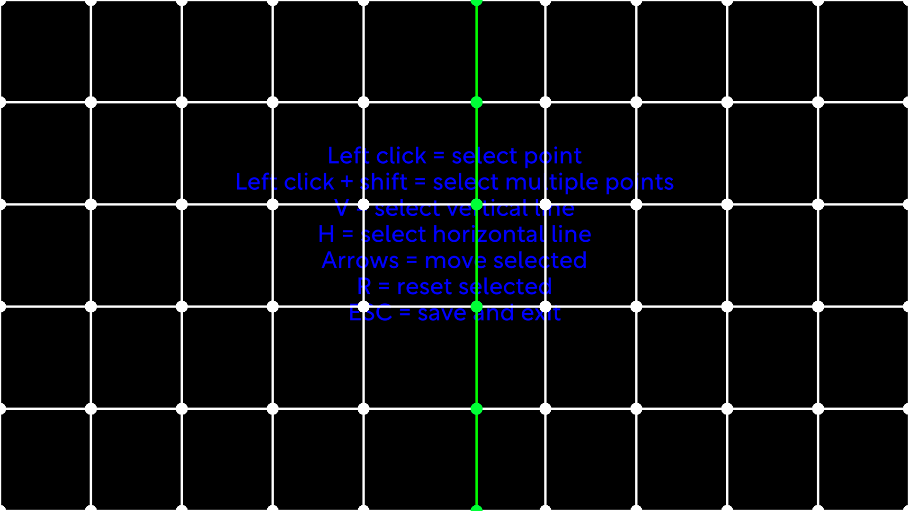
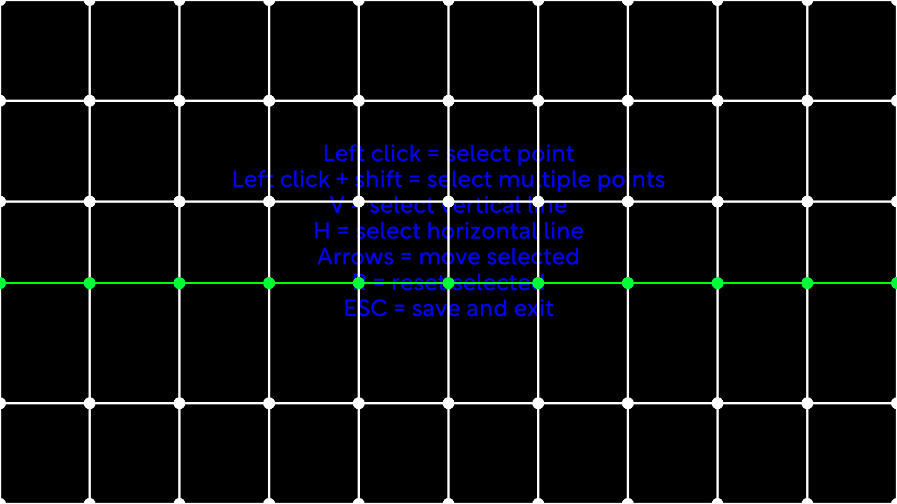
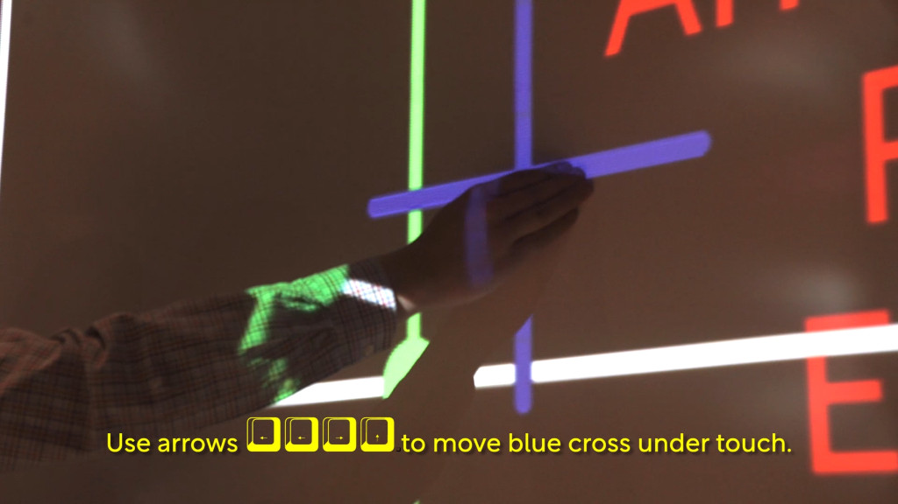
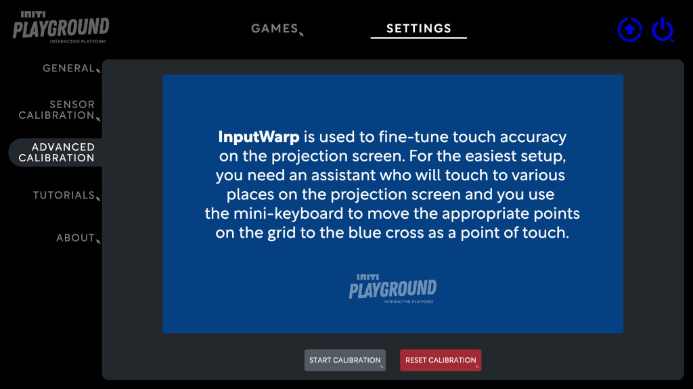
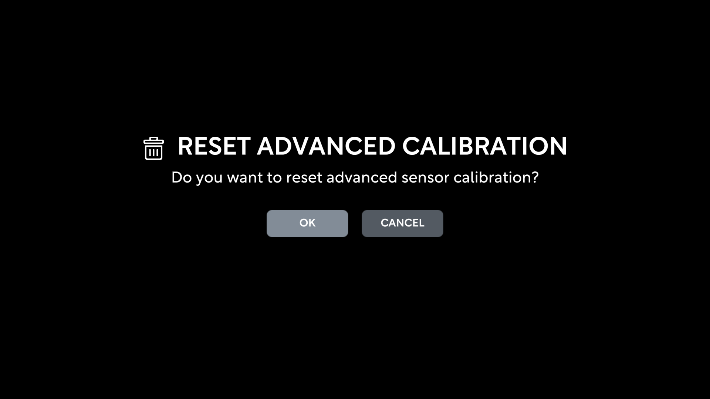

Title:   Advanced sensor calibration
Summary: Calibrating touch sensor using grid
Authors: Ondrej Prucha
Date:    July 20, 2024
blank-value:

# Advanced sensor calibration

Advanced sensor calibration allows you to fine-tune the calibration using a grid-based warping input. This process is optional but highly beneficial when the wall is not perfectly flat or when certain areas of the projection require higher precision in touch positioning and visual response alignment.

## Starting advanced calibration

- Open the UI and navigate to the `Settings` tab located at the top of the screen.
- Find and click on the `Advanced Calibration` section.
- Click `START CALIBRATION` button

## Controls

To fine-tune the calibration, use the mouse and keyboard to adjust the grid. Below is a table of controls:

| Shortcut                   | Action                       |
|:--------------------------:|:----------------------------:|
| Mouse Left-click           | select single point          |
| Shift + Mouse Left-click   | select multiple points       |
| V                          | select vertical line         |
| H                          | select horizontal line       |
| Arrows                     | move selected points         |
| R                          | reset selected points        |
| Esc                        | save and exit                |

## Moving the grid

To adjust the grid, select the points you want to move and reposition them using the arrow keys. You can select individual points, multiple points, or entire horizontal and vertical lines. Additionally, you can reset specific points to their default (unwarped) positions by selecting them and pressing the `R` key. Below are some examples:

=== "Selecting points"

    

=== "Vertical line"

    

=== "Horizontal line"

    

## Testing calibration

During the grid setup, it's important to test the calibration by touching the wall. When you touch the wall, a blue cross should appear at the point of contact, ensuring accurate alignment between touch position and visual response. It is recommended to perform this test with an assistant: one person adjusts the grid while the other touches the wall to see where the hit is registered. Refer to the image below for an illustration of this process.

## Resetting advanced calibration

To discard the current advanced calibration, click the `Reset Calibration` button at the bottom of the screen.

To prevent accidental resets, you will need to confirm this action by clicking `OK`

## Video guide

For additional guidance, check out our video tutorial below.

<iframe src="https://player.vimeo.com/video/796039649?h=7870536d0d&amp;badge=0&amp;autopause=0&amp;player_id=0&amp;app_id=58479" frameborder="0" allow="autoplay; fullscreen; picture-in-picture; clipboard-write" style="position:absolute;top:0;left:0;width:100%;height:100%;" title="INITI Playground - Advanced"></iframe>

 

Now that the sensor is successfully calibrated, it's time to move on to the next step: connecting your INITI Playground to the internet. This will enable you to access updates or download new games. Proceed to the [next section](connecting-to-the-internet.md) for detailed instructions on how to connect your system to the internet.

----

[Connecting to the internet](connecting-to-the-internet.md){ .md-button }

 