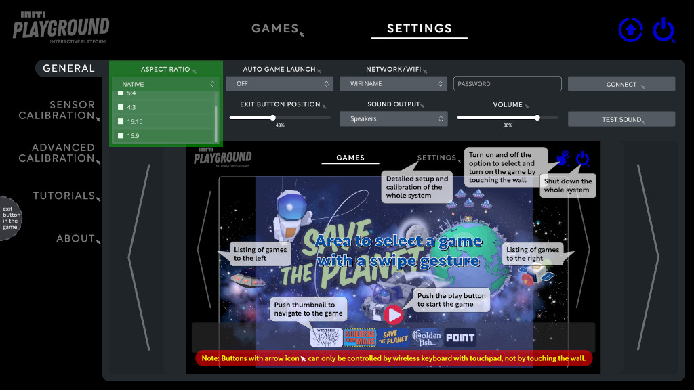
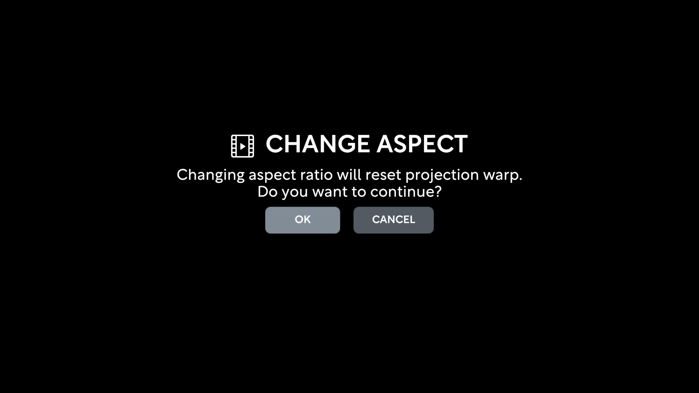

Title:   Aspect ratio
Summary: Choosing aspect ratio
Authors: Ondrej Prucha
Date:    July 19, 2024
blank-value:

#Choosing aspect ratio

Before starting the sensor calibration process, it is essential to select the correct aspect ratio for your projection. Calibration is highly dependent on the projection size, so the INITI Playground must be recalibrated each time the aspect ratio is changed.

## Supported aspect ratios

INITI Playground supports four aspect ratios

| Aspect Ratio| 16:9 | 16:10 | 4:3 | 5:4 |
|:-----------:|:----:|:-----:|:---:|:---:|
| Recommended | yes  | -     | -   | -   |

## Selecting aspect ratio

1. **Navigate to the Settings Tab:**
    
    - Open the UI and click on the `Settings` tab located at the top of the screen
  
2. **Choose Aspect Ratio:**

    - In the Settings menu, locate the section for aspect ratio settings.
    - Select the desired aspect ratio (5:4, 4:3, 16:9, or 16:10) from the available options.

        

        
        

3. **Confirm selection:**

    - After changing the aspect ratio, the sensor calibration must be redone. Click `OK` to proceed.

        

        
        

Once you have chosen and confirmed the correct aspect ratio, you can proceed with the calibration process, confident that your projection size has been accurately accounted for.

----

[Sensor calibration](sensor-calibration.md){ .md-button }

 