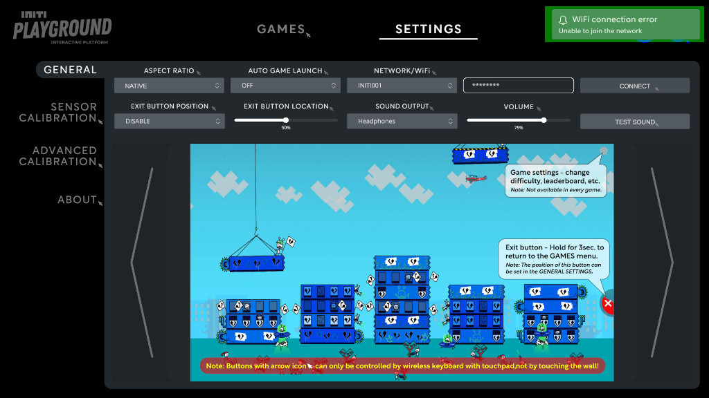

Title:   Connecting to the internet
Summary: How to connect Initi Playground using Wi-Fi
Authors: Ondrej Prucha
Date:    July 21, 2024
blank-value:

# Connecting to the internet

Initi Playground supports automatic updates. To receive notifications when a new update is available, you will need to be connected to the internet via Wi-Fi.

## Locating Wi-Fi settings

- Open the UI and navigate to the `Settings` tab at the top of the screen.
- In the `General` settings menu, find the Wi-Fi section, as shown in the picture below.

## Connecting to Wi-Fi network

- In the sound section, find the `NETWORK/WIFI` dropdown list.
- Select your Wi-Fi network from the list.

- Enter the password to your Wi-Fi.

- Press `CONNECT` button. If the Wi-Fi connection is successful, you will receive a notification stating **"Successfully connected to network XXX."** If there is an issue, such as an incorrect password, you will see an error message indicating **"Unable to join the network."**

=== "Successfully connected"

    

=== "Connection error"

    

## Disconnecting from Wi-Fi network

To disconnect from the Wi-Fi network, for instance, if you need to connect to a different network, click the `DISCONNECT` button. You will then see a notification confirming that you have been successfully disconnected.

----

[Getting updates](getting-updates.md){ .md-button }

 