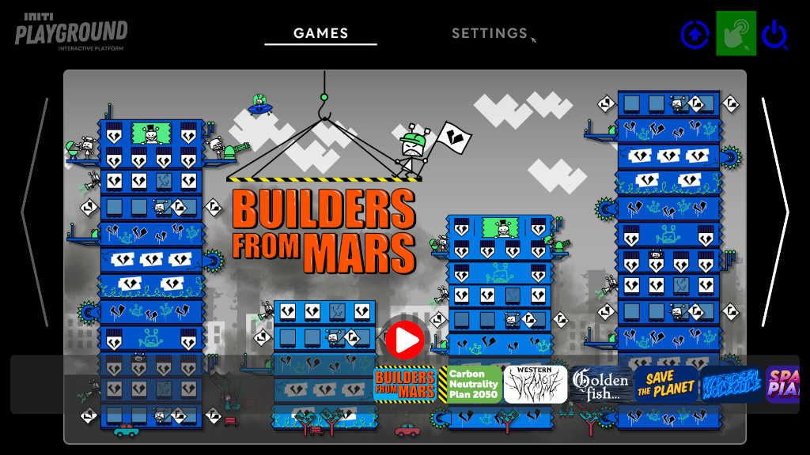
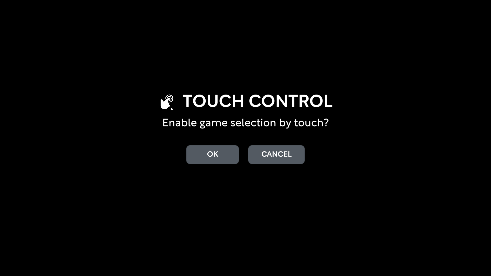
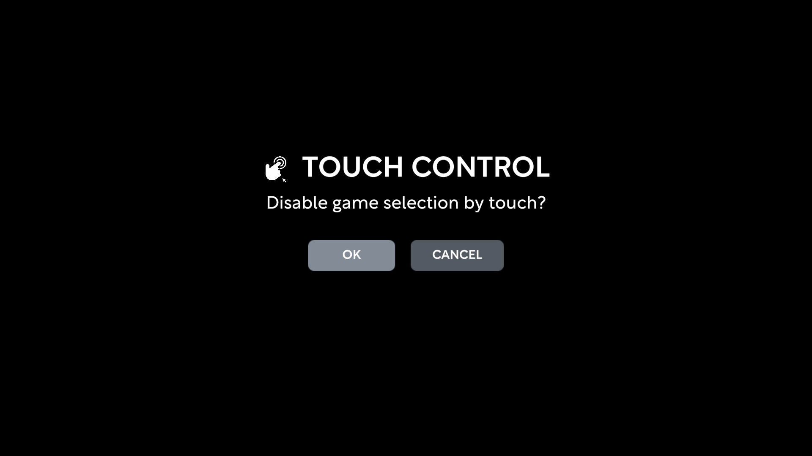

Title:   Enable touch
Summary: How to enable touch in games tab
Authors: Ondrej Prucha
Date:    July 24, 2024
blank-value:

# Enabling touch in games tab

Enabling touch creates a more interactive experience, allowing users to select and launch games by simply touching the wall. By default, this feature is turned off because the sensor needs to be calibrated first. You can turn it on or off in the Games tab.

## Enable touch

- Open the UI and navigate to the `Games` tab at the top of the screen.
- In the `Games` tab, click the touch icon in the top right corner, as illustrated in the picture below.

- Click `OK` to confirm

- Once confirmed, the touch icon will turn blue, indicating that touch is enabled. You can now select and launch games by touching the wall.

## Disable touch

Sometimes it is preferable to disable touch functionality to prevent users from switching games, thereby giving control over Initi Playground to the supervisor. In such cases, it is advisable to turn off touch and allow the supervisor to select games using a wireless keyboard.

- Open the UI and navigate to the `Games` tab at the top of the screen.
- In the `Games` tab, click the touch icon in the top right corner, as illustrated in the picture below.

- Click `OK` to confirm

- Once confirmed, the touch icon will turn grey, indicating that touch is disabled. Now the games can be selected and launched only using wireless keyboard.

----

[Starting games](starting-games.md){ .md-button }

 