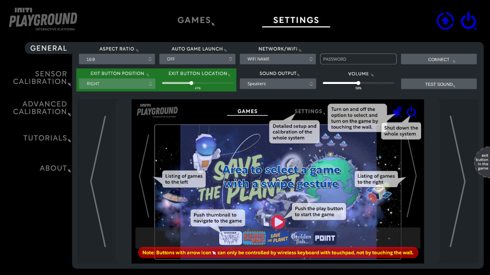
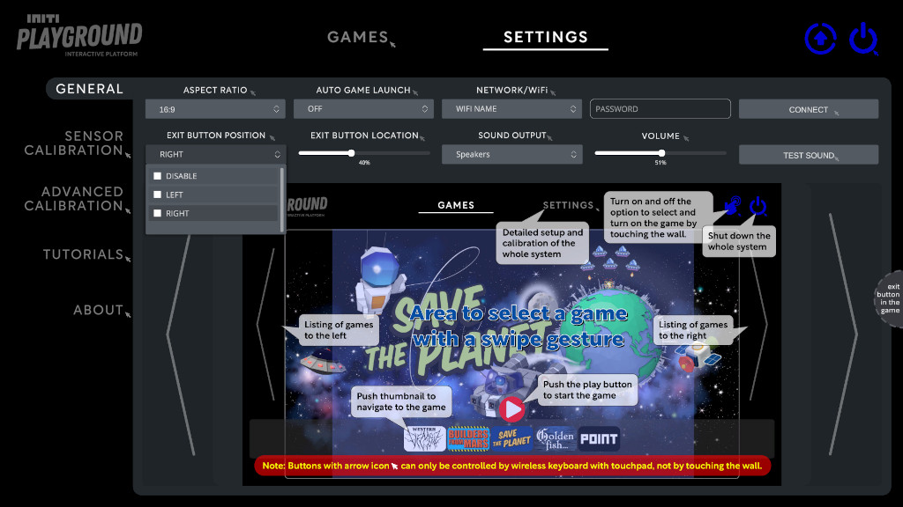
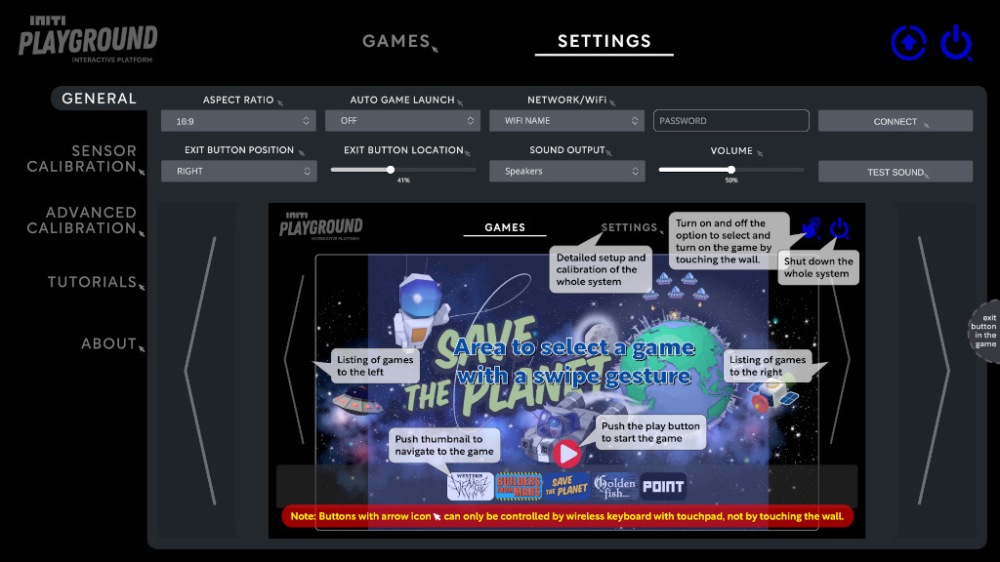
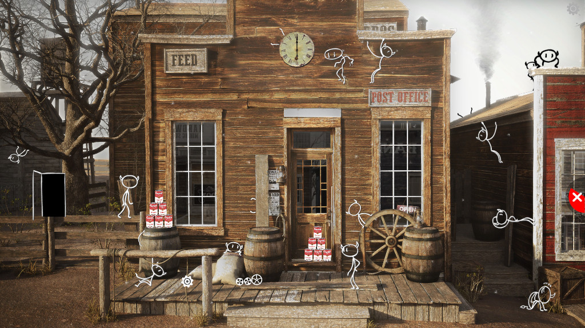
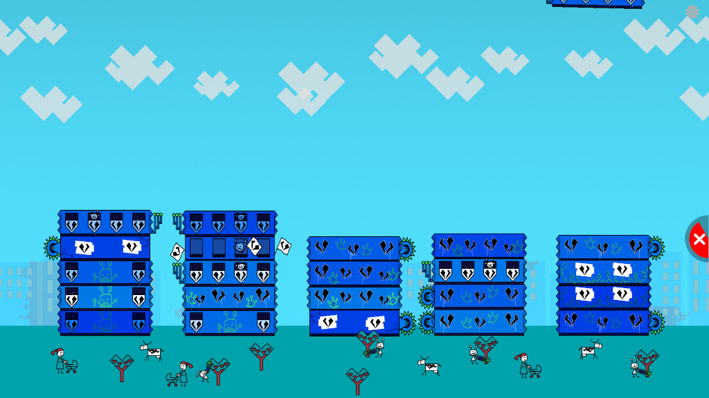

Title:   Exit button
Summary: How to configure the exit button
Authors: Ondrej Prucha
Date:    February 23, 2026
blank-value:

# Exit Button Configuration

The Exit Button is available in all INITI Playground games.  
It allows users to leave a running game and return to the main menu.

Depending on your installation, the Exit Button can be enabled for player control or disabled when games are managed exclusively by an operator.

---

## Open Exit Button Settings

1. Open the UI and navigate to the `Settings` tab at the top of the screen.
2. In the `General` settings section, locate **Exit Button Configuration**.

---

## Exit Button Position

You can choose where the Exit Button appears:

- `LEFT` – Displays the button on the left side of the projection  
- `RIGHT` – Displays the button on the right side of the projection  
- `DISABLED` – Hides the Exit Button completely

When enabled, players can end a game session and return to the main menu without operator assistance.

!!! info
    Disabling the Exit Button is useful for supervised installations, exhibitions, or events where games are controlled by staff.

<!-- ADDED: practical usage example -->

---

## Adjust Exit Button Height

Use the **location slider** to adjust the vertical position of the Exit Button.

This allows you to keep the button accessible while preventing accidental presses, for example by positioning it out of reach of smaller children.

The preview labeled **"Exit Button in the Game"** shows where the button will appear during gameplay.  
When a game starts, the Exit Button will be displayed in the same position.

=== "In settings"

    

=== "In game #1"

    

=== "In game #2"

    

----

[Automatically start games](game-autostart.md){ .md-button }

 