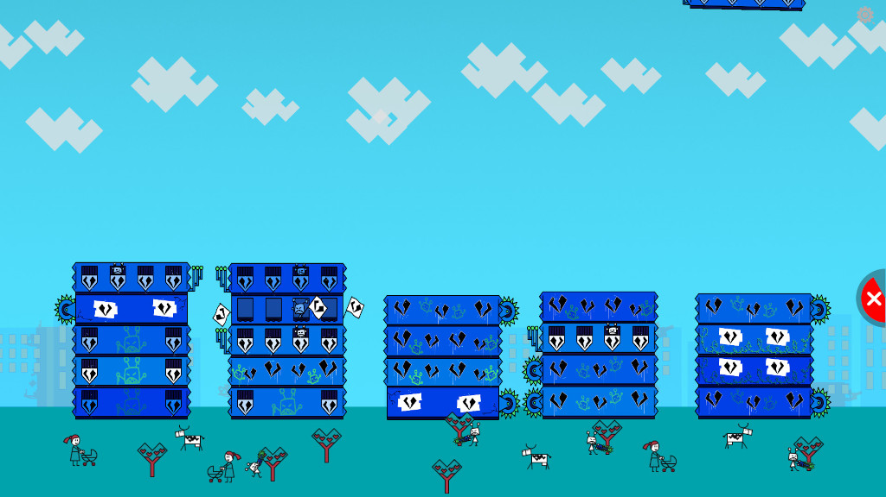

Title:   Exiting games
Summary: How to quit a game and get back to UI menu
Authors: Ondrej Prucha
Date:    February 23, 2026
blank-value:

# Exiting games

To switch games or return to the main menu, you must first exit the current game. This can be done using a wireless keyboard or, if exit button is enabled, by interacting directly with the screen.

## Using the wireless keyboard

- Press the `ESC` key on the wireless keyboard to close the current game and return to the main menu.

## Using touch

- Ensure that the Exit Button is enabled. See [Exit Button](exit-button.md) for setup instructions.
- Players can exit a game by pressing and **holding the Exit Button for 2 seconds**.  
  This allows them to return to the main menu and select another game.

!!! note
    Holding the Exit Button for 2 seconds helps prevent accidental exits during gameplay.

 