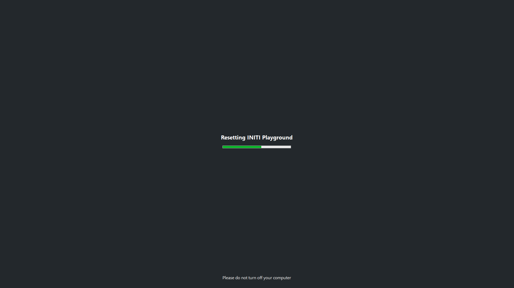

Title:   Factory reset
Summary: How to reset Initi Playground to factory settings
Authors: Ondrej Prucha
Date:    August 20, 2024
blank-value:

# Factory Reset

If you encounter issues with **Initi Playground** that cannot be resolved through standard troubleshooting, you have the option to perform a factory reset. This process will restore the system to its original settings, effectively clearing all custom configurations and data. Use this feature cautiously, as it will erase any unsaved progress and personalized settings.

## How to Perform a Factory Reset

- Ensure you have access to the keyboard connected to the Initi Playground system.
- Press and hold the `R` **key** on the keyboard.
- **Continue holding** the key for approximately **10 seconds**.
- After holding the `R` **key** for the required duration, the Initi Playground will automatically begin the reset process, as shown in the following image.

- The system will **erase all user data and settings**, reverting to the original factory configuration.
- After rebooting, the Initi Playground will be ready for fresh setup and use.

 