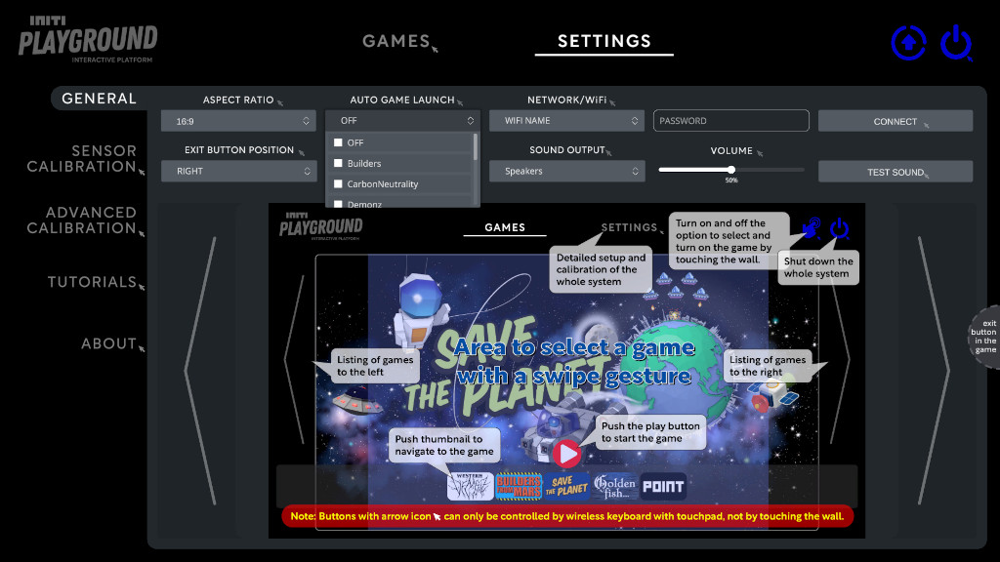

Title:   Game autostart
Summary: Automatically start games on system power-up
Authors: Ondrej Prucha
Date:    July 23, 2024
blank-value:

# Automatically start games on system power-up

The INITI Playground can be set to automatically launch a designated game upon power-up. This feature makes it perfect for environments such as museums or amusement parks, where seamless, user-independent operation is essential.

## Locating auto game launch

- Open the UI and navigate to the `Settings` tab at the top of the screen.
- In the `General` settings menu, find the `AUTO GAME LAUNCH` drop down list, as shown in the picture below.
- Select the game you want to automatically start after the system powers on from the dropdown list. To disable the automatic game start, choose `OFF` from the list.

With this configuration, the INITI Playground can operate independently, providing an uninterrupted and engaging experience for visitors in public spaces.

----

[Sound settings](sound-settings.md){ .md-button }

 