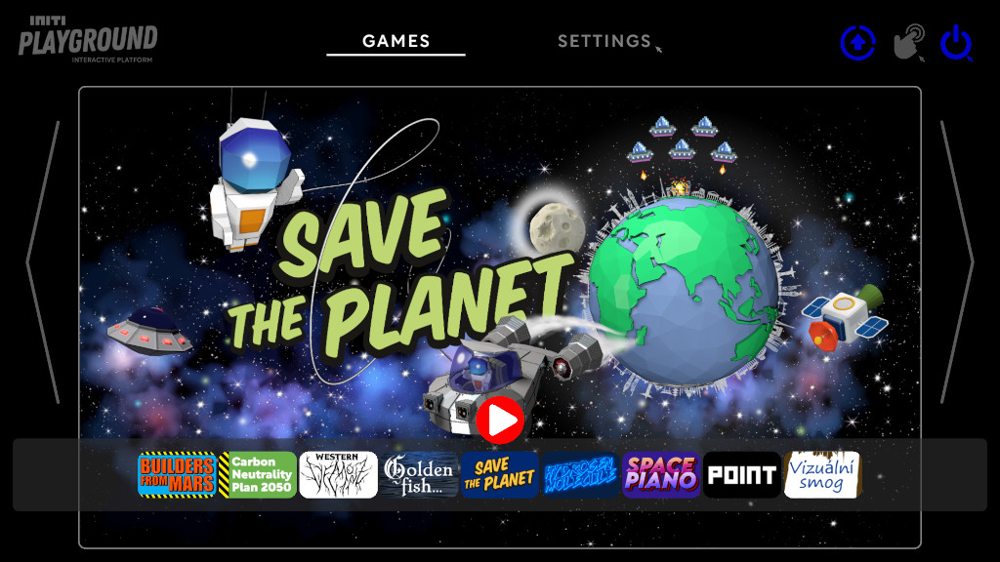
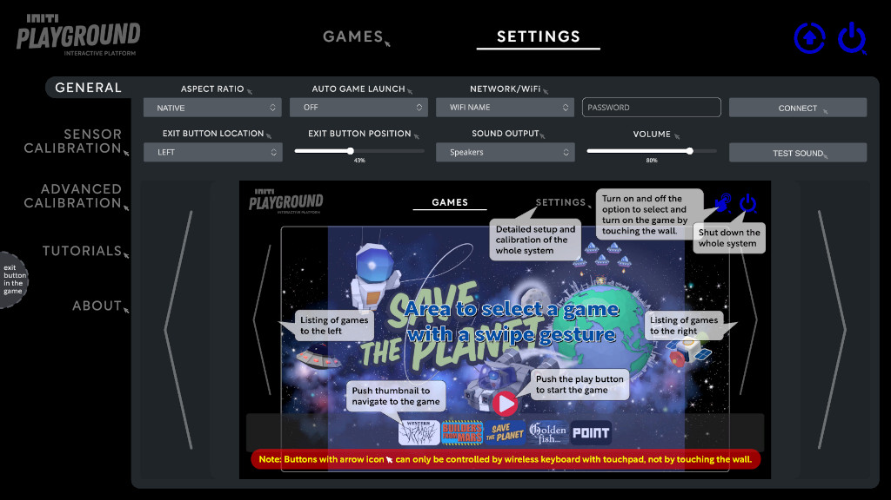

Title:   Get started
Summary: Get started using INITI Playground
Authors: Ondrej Prucha
Date:    February 22, 2026
blank-value:

#Getting started

!!! success "Prerequisites"

    Before diving in, please ensure you have completed the installation process outlined in the [Installation](../installation/index.md) part of this documentation. Once the installation is done, this guide will help you get started by providing an overview of the user interface (UI).

<h3>UI Overview</h3>
The UI is divided into two main sections: Games and Settings. These can be easily navigated using the tabs located at the top of the screen, as illustrated in the picture below.

=== "Games tab"

    

    The **Games tab** is where you browse and start interactive experiences available on your INITI Playground. Games can be launched using a mouse or by touching the wall.

=== "Settings tab"

    

    The **Settings tab** lets you configure system preferences, calibrate the touch sensor, manage system updates, and install or update games from the library.

----

[Choosing aspect ratio](aspect-ratio.md){ .md-button }

 