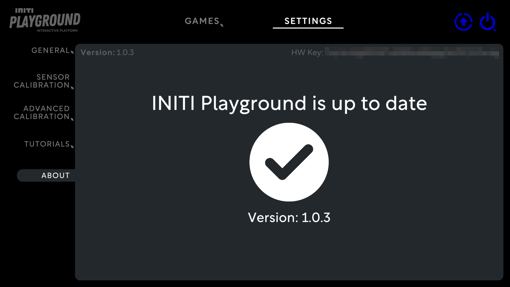
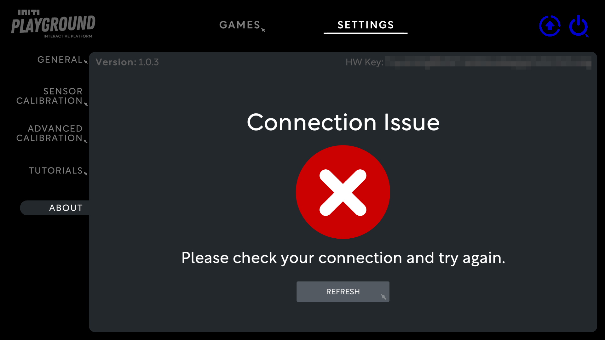
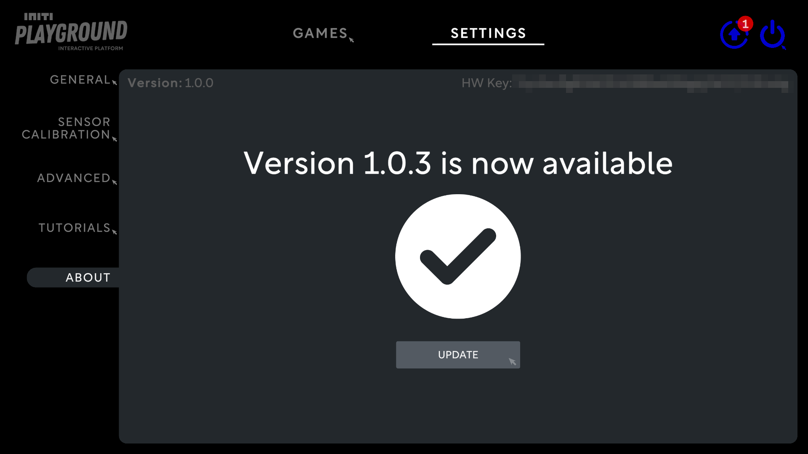

Title:   Getting updates
Summary: How to install updates for INITI Playground
Authors: Ondrej Prucha
Date:    July 21, 2024
blank-value:

# Download and install updates

!!! success "Prerequisites"

    Before you can receive updates, your INITI Playground must be connected to the internet. If you haven't completed the previous chapter, please visit the [Connecting to the Internet](connecting-to-the-internet.md) section before proceeding.

## Locating updates tab

- Open the UI and click on the `Settings` tab located at the top of the screen
- In the Settings menu, navigate to the `About` section. Here, you'll find general information about your INITI Playground, including the version, hardware key, and current status, as illustrated in the picture below.

`Version` in top left corner indicates your current version. 

`HW key` is the unique key for your INITI Playground. It is blurred out in the screenshot for security reasons. 

## Connection issues

If there are any connection issues, an error message will appear, as shown in the next screenshot. In this case, please check your Wi-Fi connection or revisit the [Connecting to the Internet](connecting-to-the-internet.md) section.

## New version available

If a new version is available, you'll see a notification on the updates icon in the top right corner, as shown in the next screenshot. To download and install the new version, simply click the `UPDATE` button. The INITI Playground will download and install the update, automatically reset, and launch the new version.

 

Now that you know how to stay up to date, you can proceed to the next chapter: the [Exit button](exit-button.md).

----

[Exit button](exit-button.md){ .md-button }

 