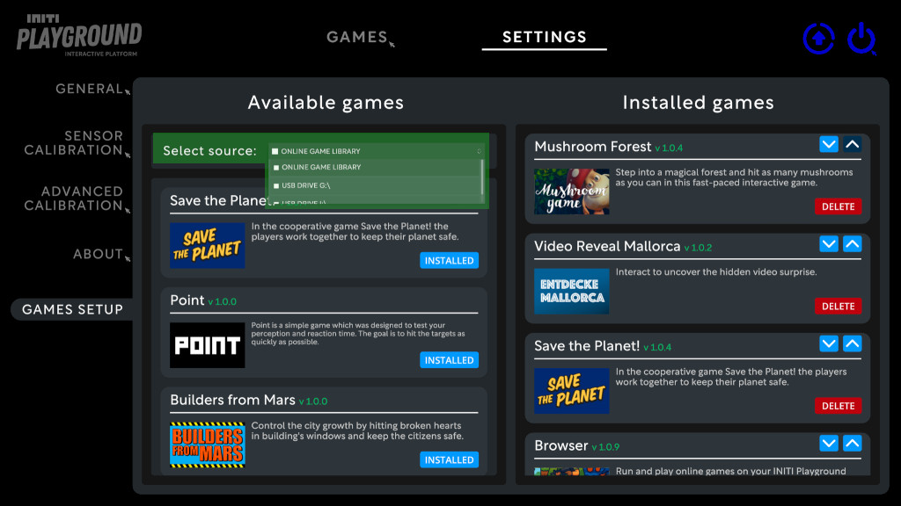
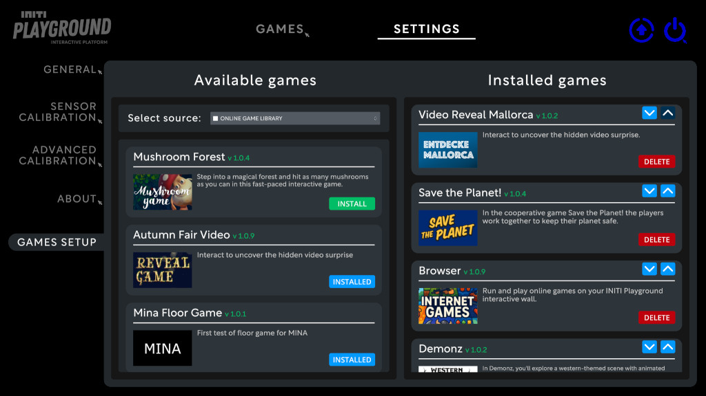
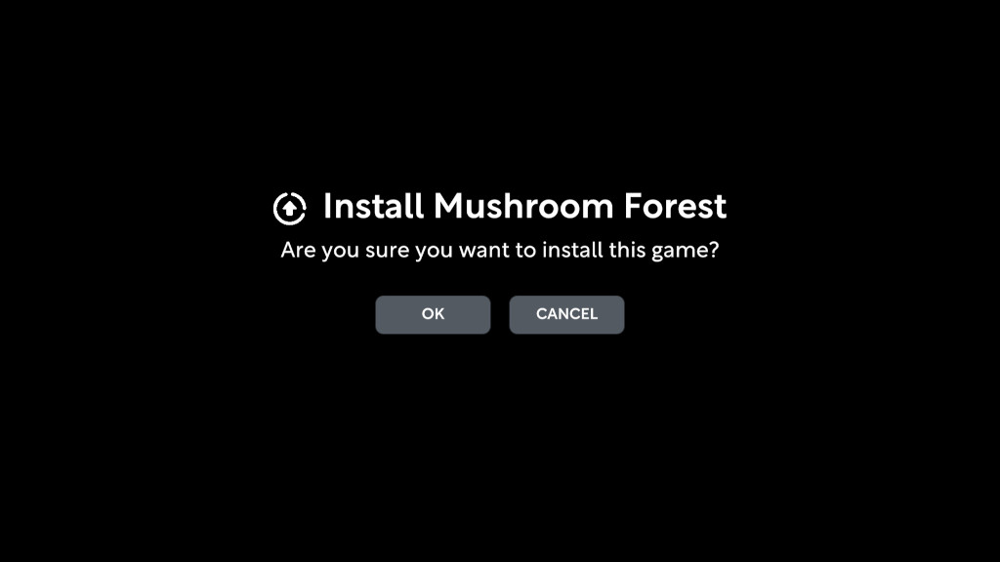

Title:   Getting updates
Summary: How to install updates for INITI Playground
Authors: Ondrej Prucha
Date:    February 24, 2026
blank-value:

# Managing Games

The **Games Setup** section allows you to install, update, organize, and control which games are available to visitors.  
This is where operators manage the content shown in the `Games` tab.

---

## Opening the Games Setup

1. Open the UI and go to the `Settings` tab at the top of the screen.
2. Navigate to the `Games Setup` section.

The screen is divided into two main areas:

- **Available Games (left side)**  
  Used for installing new games or updating existing ones.

- **Installed Games (right side)**  
  Shows games currently available on your INITI Playground.  
  Here you can remove games or change their order to control what visitors see.

---

## Installing New Games

Games can be installed in two ways:

- From the **Online Game Library** (recommended)
- From a **USB drive** (typically used for custom games)

This guide focuses on the Online Game Library, which is the easiest method.

If you want to install custom games created using the INITI Playground SDK, see the developer documentation:  

[Installing games from USB](../developers/installing-games.md){ .md-button }

**Using the Online Game Library**

!!! success "Prerequisites"
    - INITI Playground version **1.0.8 or newer**
    - Active internet connection

1. In **Available Games**, select `ONLINE GAME LIBRARY` from the `Select source` dropdown.
2. INITI Playground will load all games available for your license.

Games that are **not yet installed** or have **available updates** are displayed first.

3. Click the `INSTALL` button on a game card.
4. Confirm installation by clicking `OK`.

INITI Playground will automatically:

- download the game data,
- install the game,
- add it to your installed games list.

The newly installed game appears at the top of the **Installed Games** section.

---

## Updating Games

Games are regularly updated to introduce new gameplay features, improvements, and compatibility updates.

When an update is available, an `UPDATE` button appears on the game card.

Updating works the same way as installation:

1. Click `UPDATE`.
2. Confirm with `OK`.

Unlike new installations, **updating a game does not change its position** in the installed games list.

---

## Changing Game Order

The order of games in **Installed Games** determines how they appear inside the `Games` tab.

- Games placed higher in the list appear first.
- Use the arrow buttons on each game card to move games up or down.

Reordering games is useful when you want to:

- highlight a specific game,
- prioritize seasonal or event content,
- place your custom game first,
- control the sequence when games are switched automatically.

---

Now that your games are installed and organized, you can continue by configuring how visitors switch between games using the [Exit Button](exit-button.md).

----

[Exit button](exit-button.md){ .md-button }

 