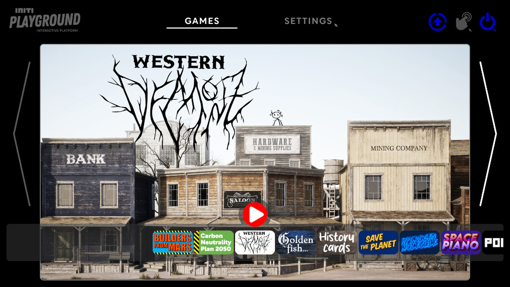
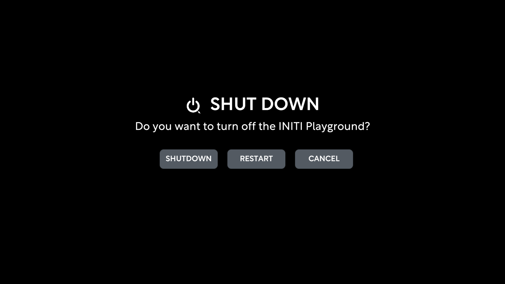

Title:   Restart and Shutdown
Summary: How to restart or shut down INITI Playground
Authors: Ondrej Prucha
Date:    August 20, 2024
blank-value:

# How to restart or shut down INITI Playground

- To shut down or restart the INITI Playground, simply locate and click the shutdown icon in the top-right corner, as shown in the picture.

- A dialog box will then appear with options to restart, shut down, or cancel. Select the action you wish to perform by clicking the corresponding button.

----

[Enable touch](enabling-touch.md){ .md-button }

 