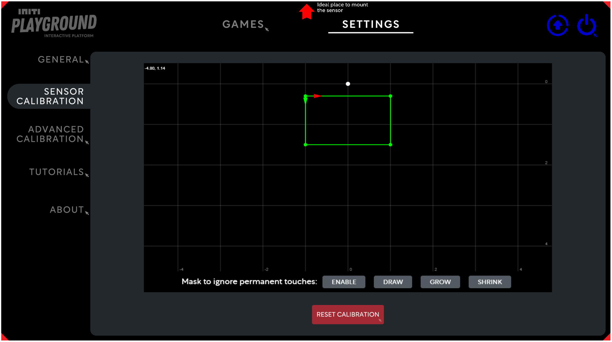
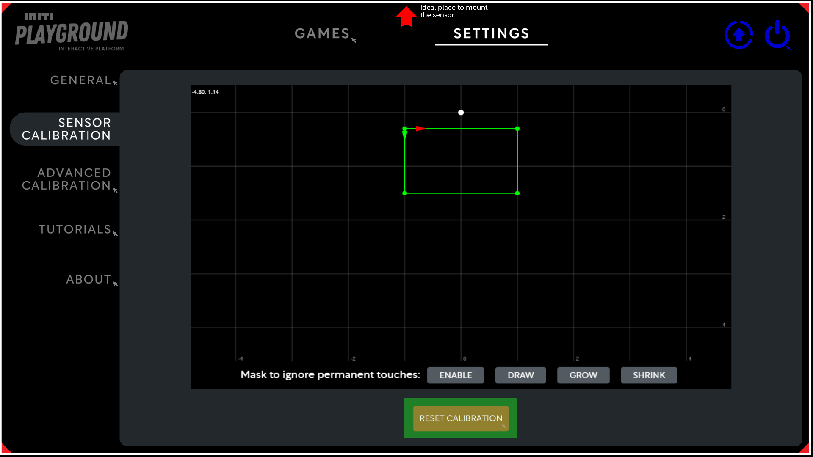
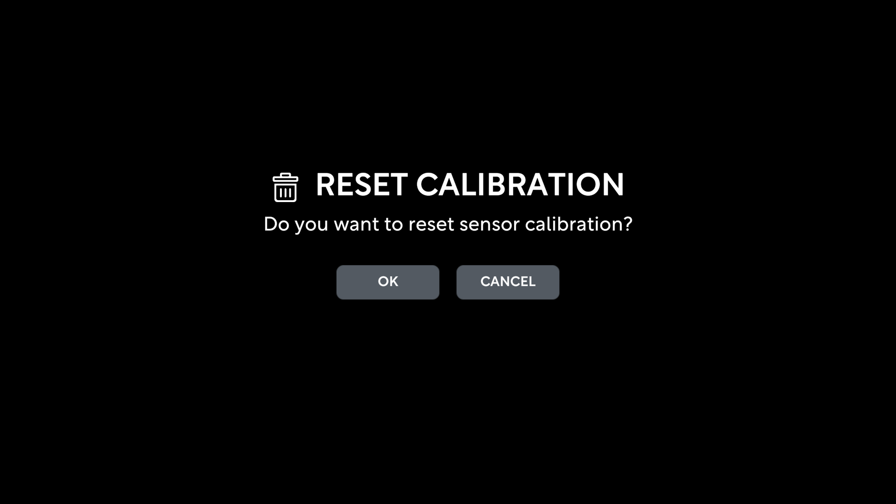

Title:   Sensor calibration
Summary: Calibrating touch sensor
Authors: Ondrej Prucha
Date:    July 20, 2024
blank-value:

# Sensor calibration

Calibrating the sensor is essential to ensure that touch positions accurately correspond with the visual responses in games. These steps will guide you through the calibration process:

- Open the UI and click on the `Settings` tab at the top of the screen. Locate the sensor calibration section, as illustrated in the picture below.
 
    

    
    

    !!! info
        The red arrow in the top center indicates the ideal location for mounting the sensor. While it is not mandatory to place the sensor in this exact spot, the best results are achieved when the sensor is positioned in the middle of the projection.

## Initiating calibration

For sensor calibration, it's best to have an assistant help by touching each of the four red corners of the projection one by one. Your task will be to recognize where the individual marks on the corners of the projection show up on the blue curve of the sensor. Then, using your mouse, drag corresponding corners of the green rectangle to these marks, aligning them with the peaks of the blue curve. These then define our entire touch area.

For a detailed demonstration of the sensor calibration process, please check the video below. It will guide you step-by-step through the setup.

<iframe src="https://player.vimeo.com/video/796039626?h=3af54663d2&amp;badge=0&amp;autopause=0&amp;player_id=0&amp;app_id=58479" frameborder="0" allow="autoplay; fullscreen; picture-in-picture; clipboard-write" style="position:absolute;top:0;left:0;width:100%;height:100%;" title="INITI Playground - Sensor calibration"></iframe>

!!! warning 
    If you don't see the blue flickering curve or if the marks on the red corners don't appear, it's likely the sensor was installed incorrectly. Please double-check your setup by reviewing the [Sensor Installation](../installation/sensor-installation.md) video.

## Resetting calibration

To discard the current calibration and start over, click the `Reset Calibration` button at the bottom of the screen.

To prevent accidental resets, you will need to confirm this action by clicking `OK`

 

Now that you're familiar with the basics of calibration, including masking and testing, you're well on your way. For a more precise calibration, explore the [Advanced calibration](advanced-sensor-calibration.md) section to refine your setup further.

----

[Advanced calibration](advanced-sensor-calibration.md){ .md-button }

 