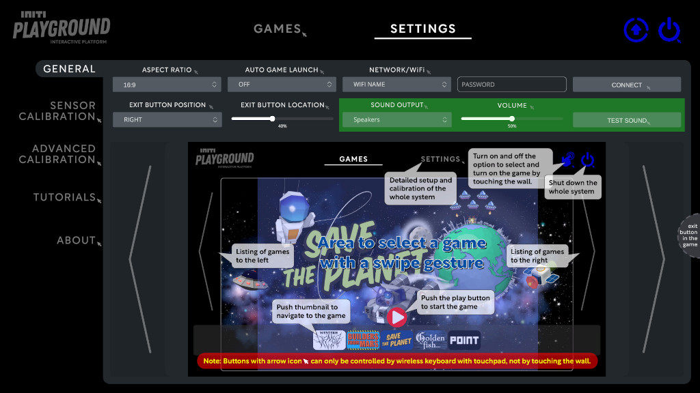
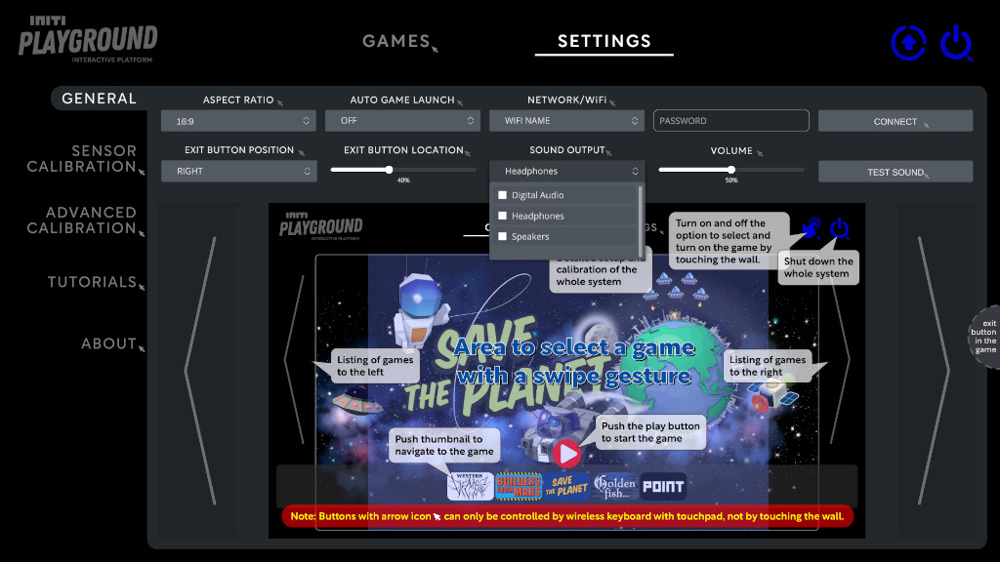

Title:   Sound settings
Summary: Select sound output device and set master volume
Authors: Ondrej Prucha
Date:    July 25, 2024
blank-value:

# Sound settings

The Sound Settings section enables users to configure audio options for the INITI Playground, including adjusting the master volume and selecting the output device.

## Locating sound settings

- Open the UI and navigate to the `Settings` tab at the top of the screen.
- In the `General` settings menu, find the sound section, as shown in the picture below.

## Select sound output device

- In the sound section, find the `SOUND OUTPUT` dropdown list.
- Select your preferred sound output device from the list (e.g., internal speakers, external speakers, projector, headphones).

## Adjust volume

Find the `VOLUME` slider and adjust it to set the overall volume level for the INITI Playground. 
!!! note
    Please note that this controls the general volume. Individual games also have their own settings menus where you can adjust game-specific volume and other related settings.

After configuring the volume and selecting the output device, click the `TEST SOUND` button. This will play a test sound to help you verify that the audio settings are correct and functioning as desired. 

----

[Restart or Shutdown](restarting-shutting-down.md){ .md-button }

 