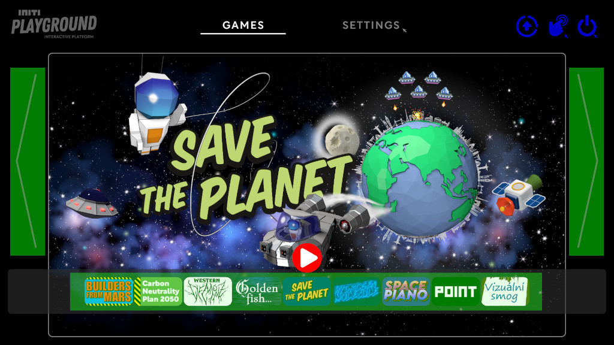
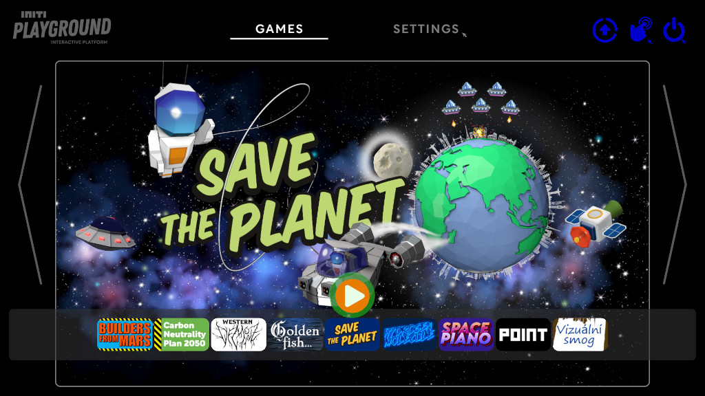

Title:   Starting games
Summary: How to select and start INITI Playground games
Authors: Ondrej Prucha
Date:    February 23, 2026
blank-value:

# Selecting and starting games

After completing the initial setup and calibration, most daily operation happens in the `Games` tab. From here, you can browse installed games and start them using either a wireless keyboard or touch interaction.

## Using the wireless keyboard

- Navigate to the `Games` tab at the top of the screen.
- Use the touchpad on the wireless keyboard to browse available games.
- You can switch between games by:
    - clicking the arrows on the left or right side of the screen, or  
    - selecting the small game icons at the bottom, as shown below.

- Once the desired game is selected, click the **Play** button in the center of the screen.

## Using touch

- Make sure touch interaction is enabled. See [Enabling Touch in the Games Tab](enabling-touch.md).
- Select a game by:
    - touching the side arrows,
    - swiping left or right, or
    - touching the game icons at the bottom of the screen.
- Start the game by touching the **Play** button in the center.

## Video tutorial

<iframe src="https://player.vimeo.com/video/796039664?h=1372ba22bb&amp;badge=0&amp;autopause=0&amp;player_id=0&amp;app_id=58479" frameborder="0" allow="autoplay; fullscreen; picture-in-picture; clipboard-write" style="position:absolute;top:0;left:0;width:100%;height:100%;" title="INITI Playground - Starting the game"></iframe>

 

----

[Exiting games](exiting-games.md){ .md-button }

 