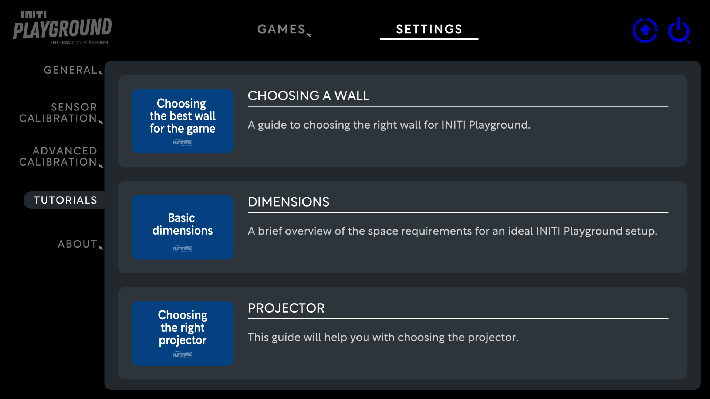

Title:   Video tutorials
Summary: List of video tutorials for INITI Playground
Authors: Ondrej Prucha
Date:    July 25, 2024
blank-value:

# Video tutorials

The `Tutorials` section provides users with quick and easy access to instructional videos that help with various settings and features of the INITI Playground. These tutorials are designed to offer step-by-step guidance, making it easier to understand and configure the system to suit your needs.

## How to Access and Use Video Tutorials

- Open the UI and navigate to the `Settings` tab at the top of the screen.
- In the `Settings` menu, find and click on the `Tutorials` section.

- You will see a list of available video tutorials covering different aspects of the INITI Playground. These may include topics such as configuration, calibration and game selection.
- Click on a tutorial to watch it.. 

----

[Restart or Shutdown](restarting-shutting-down.md){ .md-button }

 